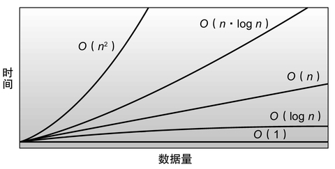
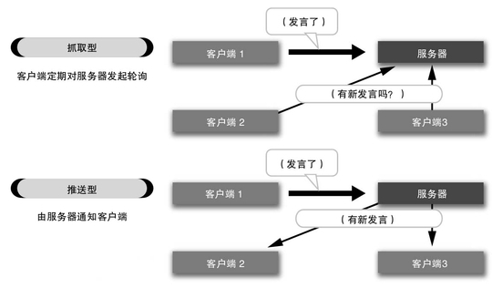
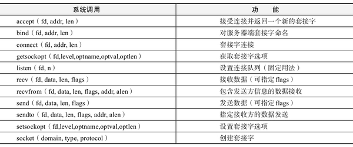
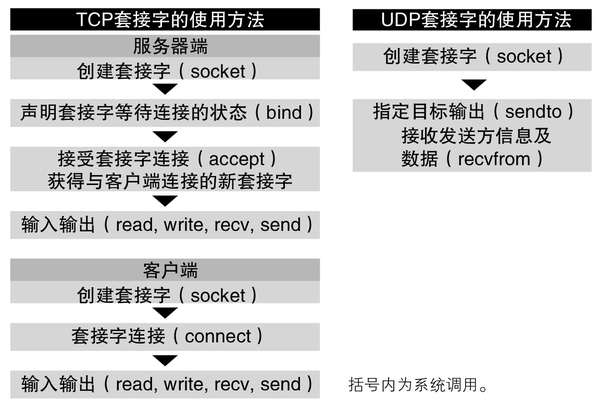
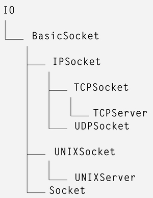
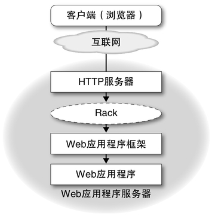
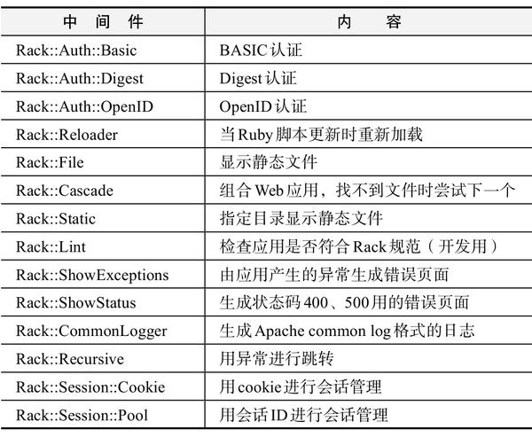
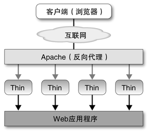
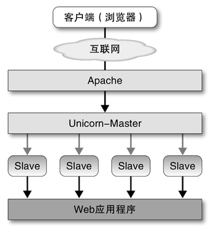
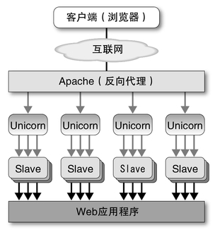

# 第四章：云计算时代的编程

## 4.1　可扩展性

根据美国加州大学伯克利分校所做的一项名为“How Much Informa-tion?”的调查结果，2002年人类新创造的数据总量已超过5艾字节（EB）。其中艾（Exa，艾克萨）是10的18次方，或者说是2的60次方的前缀。这类前缀还有很多，按顺序分别为千（Kilo，10的3次方）、兆（Mega，10的6次方）、吉（Giga，10的9次方）、太（Tera，10的12次方）、拍（Peta，10的15次方）、艾（Exa，10的18次方）。

此外，根据这项调查做出的预测，2006年人类的信息总量可达到161EB，2010年可达到约988EB（约等于1ZB，Z为Zetta，即10的21次方字节）。这意味着，人类在1年内所产生并记录的数据量，已经超过了截止到20世纪末人类所创造的全部信息的总量。

如此大量的信息被创造、流通和记录，这被称为信息爆炸。生活在21世纪的我们，每天都必须要处理如此庞大的信息量。

信息爆炸并不仅仅是社会整体所面临的问题，我们每个人所拥有的数据每天也在不断增加。在我最早接触计算机的20世纪80年代初，存储媒体一般采用5英寸软盘。面对320KB的“大容量”，当时还是初中生的我曾经感叹到：这些数据容量恐怕一辈子都用不完吧。

然而，在20多年以后，我所使用的电脑硬盘容量就已经有160GB之多，相当于5英寸软盘的50万倍。更为恐怖的是，这些容量的8成都已经被各种各样的数据所填满了。刚刚我查了一下，就光我手头保存的电子邮件，压缩之后也足足有3.7GB之多，而这些邮件每天还在不断增加。

### 信息的尺度感

在物理学的世界中，随着尺度的变化，物体的行为也会发生很大的变化。量子力学所支配的原子等粒子世界中，以及像银河这样的天文学世界中，都会发生一些在我们身边绝对见不到的现象。

在粒子世界中，某个粒子的存在位置无法明确观测到，而只能用概率论来描述。据说，这是因为要观测粒子，必须要通过光（也就是光子这种粒子）等其他粒子的反射才能完成，而正是这种反射，就干扰了被观测粒子在下一瞬间的位置。

不仅如此，在量子力学的世界中，仿佛可以无视质量守恒定律一样，会发生一些神奇的现象，比如从一无所有的地方产生一个粒子，或者粒子以类似瞬间移动的方式穿过毫无缝隙的墙壁等，这真是超常识的大汇演。

天文世界也是一样。两端相距数亿光年的银河星团，以及由于引力太强连光都无法逃出的黑洞，这些东西仅凭日常的感觉是很难想象的。

这些超乎常理的现象的发生，是因为受到了一些平常我们不太留心的数值的影响。例如光速、原子等粒子的大小、时间的尺度等，它们的影响是无法忽略的。

在IT世界中也发生了同样的事情。从小尺度上来说，电路的精密化导致量子力学的影响开始显现，从而影响到摩尔定律；从大尺度上来说，则产生了信息爆炸导致的海量数据问题。

和人不同，计算机不会感到疲劳和厌烦，无论需要多少时间，最终都能够完成任务。然而，如果无法在现实的时间范围内得出结果，那也是毫无用处的。当数据量变得很大时，就会出现以前从来没有考虑过的各种问题，对于这些问题的对策必须要仔细考量。

下面我们以最容易理解的例子，来看一看关于数据保存和查找的问题。

### 大量数据的查找

所谓查找，就是在数据中找出满足条件的对象。最简单的数据查找算法是线性查找。所谓线性查找其实并不难，只要逐一取出数据并检查其是否满足条件就可以了，把它叫做一种算法好像也确实夸张了一些。

线性查找的计算量为O(n)，也就是说，和查找对象的数据量成正比。在算法的性能中，还有很多属于O(n2)、O(n·log n)等数量级的，相比之下O(n)还算是好的（图1）。

C>

C>图1　算法计算性能的差异

即便如此，随着数据量的增加，查找所需的时间也随之不断延长。假设对4MB的数据进行查找只需要0.5秒，那么对4GB（=4000MB）的查找计算就需要8分20秒，这个时间已经算比较难以忍受的了。而如果是4TB（=4000GB）的数据，单纯计算的时间就差不多需要6天。

像Google等搜索引擎所搜索的数据量，早已超过TB级，而达到了PB级。因此很明显，采用单纯的线性查找是无法实现的。那么，对于这样的信息爆炸，到底应该如何应对呢？

### 二分法查找

从经验上看，计算性能方面的问题，只能用算法来解决，因为小修小补的变更只能带来百分之几到百分之几十的改善而已。

在这里，我们来介绍一些在一定前提条件下，可以极大地改善查找计算量的算法，借此来学习应对信息爆炸在算法方面的思考方式。

对于没有任何前提条件的查找，线性查找几乎是唯一的算法，但实际上，大多数情况下，数据和查找条件中都存在着一定的前提。利用这些前提条件，有一些算法就可以让计算量大幅度减少。首先，我们来介绍一种基本的查找算法——二分法查找（binary search）。

使用二分法查找的前提条件是，数据之间存在大小关系，且已经按照大小关系排序。利用这一性质，查找的计算量可以下降到O(log n)。

线性查找大多数是从头开始，而二分法查找则是从正中间开始查找的。首先，将要查找的对象数据和正好位于中点的数据进行比较，其结果有三种可能：两者相等；查找对象较大；查找对象较小。

如果相等则表示已经找到，查找就结束了。否则，就需要继续查找。但由于前提条件是数据已经按照大小顺序进行了排序，因此如果查找对象数据比中点的数据大，则要找的数据一定位于较大的一半中，反之，则一定位于较小的一半中。通过一次比较就可以将查找范围缩小至原来的一半，这种积极缩小查找范围的做法，就是缩减计算量的诀窍。

这个算法用Ruby编写出来如图2所示。图2中定义的方法接受一个已经排序的数组data，和一个数值value。如果value在data中存在的话，则返回其在data中的元素位置索引，如果不存在则返回nil。

{lang="ruby"}
	def bsearch(data, value)
	  lo = 0
	  hi = data.size
	  while lo < hi
	    mid = (lo + hi) / 2  # Note: bug in Programming Pearl
	    if data[mid] < value
	      lo = mid + 1;
	    else
	      hi = mid;
	    end
	  end
	  if lo < data.size && data[lo] == value
	    lo  # found
	  else
	    nil # not found
	  end
	end

C>图2　二分法查找程序

二分法查找的计算量在n（=数据个数）较小时差异不大，但随着n的增大，其差异也变得越来越大。

表1显示了随着数据个数的增加，log n的增加趋势。当只有10个数据时，n和log n的差异为4.3倍；但当有100万个数据时，差异则达到了72000倍。

C>表1　O(n)和O(log n)的计算量变化

|n|log n|n / log n（倍）|
|10|2.302585093|4.342944819|
|100|4.605170186|21.7147241|
|1000|6.907755279|144.7648273|
|10000|9.210340372|1085.736205|
|100000|11.51292546|8685.889638|
|1000000|13.81551056|72382.41365|

说句题外话，出人意料的是，二分法查找的实现并非一帆风顺。例如，1986年出版的Jon Bentley所著的《编程珠玑》（Programming Pearls）一书中，就介绍了二分法查找的算法。虽然其示例程序存在bug，但直到2006年，包括作者自己在内，竟然没有任何人注意到。

这个bug就位于图2的第5行Note注释所在的地方。《编程珠玑》中原始的程序是用C语言编写的。在C这样的语言中，lo和hi之和有可能会超过正整数的最大值，这样的bug被称为整数溢出（integer overflow）。

因此，在C语言中，这个部分应该写成

{lang="ruby"}
	mid = lo + ((hi - lo) / 2)

来防止溢出。在1986年的计算机上，索引之和超过整数最大值的情况还非常少见，因此，在很长一段时间内，都没有人注意到这个bug。

再说句题外话的题外话，Ruby中是没有“整数的最大值”这个概念的，非常大的整数会自动转换为多倍长整数。因此，图2的Ruby程序中就没有这样的bug。

### 散列表

从计算量的角度来看，理想的数据结构就是散列表。散列表是表达一个对象到另一个对象的映射的数据结构。Ruby中有一种名为Hash的内建数据结构，它就是散列表。从概念上来看，由于它是一种采用非数值型索引的数组，因此也被称为“联想数组”，但在Ruby中（Perl也是一样）从内部实现上被称为Hash。而相应地，Smalltalk和Python中相当于Hash的数据结构则被称为字典（Dictionary）。

散列表采用了一种巧妙的查找方式，其平均的查找计算量与数据量是无关的。也就是说，用O记法来表示的话就是O(1)。无论数据量如何增大，访问其中的数据都只需要一个固定的时间，因此已经算是登峰造极了，从理论上来说。

在散列表中，需要准备一个“散列函数”，用于将各个值计算成为一个称为散列值的整数。散列函数需要满足以下性质：

* 从数据到整数值（0～N-1）的映射
* 足够分散
* 不易冲突

“足够分散”是指，即便数据只有很小的差异，散列函数的计算结果也需要有很大的差异。“不易冲突”是指，不易发生由不同的数据得到相同散列值的情况。

当存在这样一个散列函数时，最简单的散列表，可以通过以散列值为索引的数组来表现（图3）。

{lang="ruby}
	hashtable = [nil] * N     ← 根据元素数量创建数组
	def hash_set(hashtable, x, y)  ← 数据存放（将散列值作为索引存入）
	  hashtable[hash(x)] = y
	end
	
	def hash_get(hashtable, x)     ← 数据取出（将散列值作为索引取出）
	  hashtable[hash(x)]
	end

C>图3　最简单的散列表

由于散列值的计算和指定索引访问数组元素所需的时间都和数据个数无关，因此可以得出，散列表的访问计算量为O(1)。

不过，世界上没有这么简单的事情，像图3这样单纯的散列表根本就不够实用。作为实用的散列表，必须能够应对图3的散列表没有考虑到的两个问题，即散列值冲突和数组溢出。

虽然散列函数是数据到散列值的映射，但并不能保证这个映射是一对一的关系，因此不同的数据有可能得到相同的散列值。像这样，不同的数据拥有相同散列值的情况，被称为“冲突”。作为实用的散列表，必须要能够应对散列值的冲突。

在散列表的实现中，应对冲突的方法大体上可以分为链地址法（chain-ing）和开放地址法（open addressing）两种。链地址法是将拥有相同散列值的元素存放在链表中，因此随着元素个数的增加，散列冲突和查询链表的时间也跟着增加，就造成了性能的损失。

不过，和后面要讲到的开放地址法相比，这种方法的优点是，元素的删除可以用比较简单且高性能的方式来实现，因此Ruby的Hash就采用了这种链地址法。

另一方面，开放地址法则是在遇到冲突时，再继续寻找一个新的数据存放空间（一般称为槽）。寻找空闲槽最简单的方法，就是按顺序遍历，直到找到空闲槽为止。但一般来说，这样的方法太过简单了，实际上会进行更复杂一些的计算。Python的字典就是采用了这种开放地址法。

开放地址法中，在访问数据时，如果散列值所代表的位置（槽）中不存在所希望的数据，则要么代表数据不存在，要么代表由于散列冲突而被转存到别的槽中了。于是，可以通过下列算法来寻找目标槽：

{lang="text"}
	（1）计算数据（key）的散列值
	（2）从散列值找到相应的槽（如果散列值比槽的数量大则取余数）
	（3）如果槽与数据一致，则使用该槽→查找结束
	（4）如果槽为空闲，则散列表中不存在该数据→查找结束
	（5）计算下一个槽的位置
	（6）返回第3步进行循环

由于开放地址法在数据存放上使用的是相对普通的数组方式，和链表相比所需的内存空间更少，因此在性能上存在有利的一面。

不过，这种方法也不是尽善尽美的，它也有缺点。首先，相比原本的散列冲突发生率来说，它会让散列冲突发生得更加频繁。因为在开发地址法中，会将有冲突的数据存放到“下一个槽”中，这也就意味着“下一个槽”无法用来存放原本和散列值直接对应的数据了。

当存放数据的数组被逐渐填满时，像这样的槽冲突就会频繁发生。一旦发生槽冲突，就必须通过计算来求得下一个槽的位置，用于槽查找的处理时间就会逐渐增加。因此，在开放地址法的设计中，所使用的数组大小必须是留有一定余量的。

其次，数据的删除比较麻烦。由于开放地址法中，一般的元素和因冲突而不在原位的元素是混在一起的，因此无法简单地删除某个数据。要删除数据，仅仅将删除对象的数据所在的槽置为空闲是不够的。

这样一来，开放地址法中的连锁就可能被切断，从而导致本来存在的数据无法被找到。因此，要删除数据，必须要将存放该元素的槽设定为一种特殊的状态，即“空闲（允许存放新数据）但不中断对下一个槽的计算”。

随着散列表中存放的数据越来越多，发生冲突的危险性也随之增加。假设真的存在一种理想的散列函数，对于任何数据都能求出完全不同的散列值，那么当元素个数超过散列表中槽的个数时，就不可避免地会产生冲突。尤其是开放地址法中当槽快要被填满时，所引发的冲突问题更加显著。

无论采用哪种方法，一旦发生冲突，就必须沿着某种连锁来寻找数据，因此无法实现O(1)的查找效率。

因此，在实用的散列表实现中，当冲突对查找效率产生的不利影响超过某一程度时，就会对表的大小进行修改，从而努力在平均水平上保持O(1)的查找效率。例如，在采用链地址法的Ruby的Hash中，当冲突产生的链表最大长度超过5时，就会增加散列表的槽数，并对散列表进行重组。另外，在采用开放地址法的Python中，当三分之二的槽被填满时，也会进行重组。

即便在最好的情况下，重组操作所需的计算量也至少和元素的个数相关（即O(n)），不过，只要将重组的频度尽量控制在一个很小的值，就可以将散列表的平均访问消耗水平维持在O(1)。

散列表通过使用散列函数避免了线性查找，从而使得计算量大幅度减少，真是一种巧妙的算法。

### 布隆过滤器

下面我们来介绍另一种运用了散列函数的有趣的数据结构——布隆过滤器（Bloom filter）。

布隆过滤器是一种可以判断某个数据是否存在的数据结构，或者也可以说是判断集合中是否包含某个成员的数据结构。布隆过滤器的特点如下：

* 判断时间与数据个数无关（O(1)）
* 空间效率非常好
* 无法删除元素
* 偶尔会出错（！）

“偶尔会出错”这一条貌似违背了我们关于数据结构的常识，不过面对大量数据时，我们的目的是缩小查找的范围，因此大多数情况下，少量的误判并不会产生什么问题。

此外，布隆过滤器的误判都是假阳性（false positive），也就是说只会将不属于该集合的元素判断为属于该集合，而不会产生假阴性（false negative）的误判。像布隆过滤器这样“偶尔会出错”的算法，被称为概率算法（prob-abilistic algorithm）。

布隆过滤器不但拥有极高的时间效率（O(1)），还拥有极高的空间效率，理论上说（假设误判率为1%），平均每个数据只需要9.6比特的空间。包括散列表在内，其他表示集合的数据结构中都需要包含原始数据，相比之下，这样的空间效率简直是压倒性的。

布隆过滤器使用k个散列函数和m比特的比特数组（bit array）。作为比特数组的初始值，所有比特位都被置为0。向布隆过滤器插入数据时，会对该数据求得k个散列值（大于0小于m），并以每个散列值为索引，将对应的比特数组中的比特位全部置为1。

要判断布隆过滤器中是否包含某个数据，则需求得数据的k个散列值，只要其对应的比特位中有任意一个为0，则可以判断集合中不包含该数据。

即便所有k个比特都为1，也可能是由于散列冲突导致的偶然现象而已，这种情况下就产生了假阳性。假阳性的发生概率与集合中的数据个数n、散列函数种类数k，以及比特数组的大小m有关。如果m相对于n太小，就会发生比特数组中所有位都为1，从而将所有数据都判定为阳性的情况。

此外，当k过大时，每个数据所消耗的比特数也随之增加，比特数组填充速度加快，也会引发误判。相反，当k过小时，比特数组的填充速度较慢，但又会由于散列冲突的增多而导致误判的增加。

在信息爆炸所引发的大规模数据处理中，像布隆过滤器这样的算法，应该会变得愈发重要。

### 一台计算机的极限

刚才我们介绍的二分法查找、散列表和布隆过滤器，都是为了控制计算量，从而在现实的时间内完成大量数据处理的算法。

然而，仅仅是实现了这些算法，还不足以应对真正的信息爆炸，因为信息爆炸所产生的数据，其规模之大是不可能由一台计算机来完成处理的。最近，一般能买到的一台电脑中所搭载的硬盘容量最大也就是几TB，内存最大也就是8GB左右吧。

在摩尔定律的恩泽下，虽然这样的容量已然是今非昔比，但以数TB的容量来完成对PB级别数据的实时处理，还是完全不够的。

那该怎么办呢？我们需要让多台计算机将数据和计算分割开来进行处理。一台计算机无法处理的数据量，如果由100台、1000台，甚至是1万台计算机进行合作，就可以在现实的时间内完成处理。幸运的是，计算机的价格越来越便宜，将它们连接起来的网络带宽也越来越大、越来越便宜。Google等公司为了提供搜索服务，动用了好几个由数十万台PC互相连接起来所构成的数据中心。“云”这个词的诞生，也反映出这种由多台计算机实现的分布式计算，重要性越来越高。

然而，在数万台计算机构成的高度分布式环境中，如何高效进行大量数据保存和处理的技术还没有得到普及。因为在现实中，能够拥有由如此大量的计算机所构成的计算环境的，也只有Google等屈指可数的几家大公司而已。

假设真的拥有了大量的计算机，也不能完全解决问题。在安装大量计算机的大规模数据中心中，最少每天都会有几台计算机发生故障。也就是说，各种分布式处理中，都必须考虑到由于计算机故障而导致处理中断的可能性。这是在一台计算机上运行的软件中不太会考虑的一个要素。其结果就是，相比不包含分布式计算的程序开发来说，高度分布式编程得难度要高出许多。

### DHT（分布式散列表）

在分布式环境下工作的散列表被称为DHT（Distributed Hash Table，分布式散列表）。DHT并非指的是一种特定的算法，而是指将散列表在分布式环境中进行实现的技术的统称。实现DHT的算法包括CAN、Chord、Pas-try、Tapestry等。

DHT的算法非常复杂，这种复杂性是有原因的。在分布式环境，尤其是P2P环境中实现散列表，会遇到以下问题：

* 由于机器故障等原因导致节点消失
* 节点的复原、添加
* 伴随上述问题产生的数据位置查找（路由）困难的问题

因此，基本上数据都会以多份副本进行保存。此外，为了应对节点的增减，需要重新计算数据的位置。

近年来，运用DHT技术，在分布式环境下实现非关系型数据库的键-值存储（key-value store）数据库受到越来越多的关注。键-值存储的例子包括CouchDB、TokyoTyrant、Kai、Roma等。

简单来说，这些数据库是通过网络进行访问的Hash，其数据分别存放在多台计算机中。它们都有各自所针对的数据规模、网络架构和实现语言等方面的特点。

关于分布式环境下的数据存储，除了键-值存储以外，还有像GFS（Google File System）这样的分布式文件系统技术。GFS是后面要讲到的MapReduce的基础。

GFS并不是开源的，只能在Google公司内部使用，但其基本技术已经以论文的形式公开发表，基于论文所提供的信息，也出现了（一般认为）和GFS具备同等功能的开源软件“HFS”（Hadoop File System）。

### Roma

作为键-值存储数据库的一个例子，下面介绍我参与开发的Roma。Roma（Rakuten On-Memory Architecture）是乐天技术研究所开发的键-值存储数据库，是在乐天公司内部为满足灵活的分布式数据存储需求而诞生的。其特点如下：

* 所有数据都存放在内存中的内存式数据库（In-Memory Database，IMDB）
* 采用环状的分布式架构
* 数据冗余化：所有数据除了其本身之外，还各自拥有两个副本
* 运行中可自由增减节点
* 以开源形式发布

Roma是由多台计算机构成的，这些节点的配置形成了一个虚拟的环状结构（图4）。这种圆环状的结构让人联想到罗马竞技场，这也正是Roma这个名字的由来。

C>

C>图4　Roma的架构

当客户端需要向Roma存储一个键-值对时，首先根据键的数据求出其散列值。Roma中的散列值是一个浮点数，在圆环状的结构中，每个节点都划定了各自所负责的散列值范围，客户端根据散列值找出应该存放该数据的节点，并向该节点请求存储键所对应的值。由于节点的选择是通过散列函数来计算的，因此计算量是固定的。

Roma中一定会对数据进行冗余化，所以在数据被写入时，该节点会向其两边相邻的节点发起数据副本请求。因此，对于所有的数据，都会在其负责节点以及两个相邻节点的总共三个节点中保存副本。

Roma的数据基本上是保存在各个节点的内存中的，但为了避免数据丢失，会在适当的时机以文件的形式输出快照。万一遇到Roma系统整体紧急关闭的情况，通过快照和数据写入日志，就可以恢复所有的数据。数据的取出也是同样通过计算散列值找到相应的节点，并对该节点发出请求。

对于像Roma这样的分布式键-值存储数据库来说，最大的难题在于节点的增减。由大量计算机所构成的系统，必须时刻考虑到发生故障的情况。此外，有时候为了应对数据量和访问量的急剧增加，也会考虑在系统工作状态下增加新节点。

在故障等原因导致节点减少的情况下，一直保持联系的相邻节点会注意到这个变化，并对环状结构进行重组。首先，消失的节点所负责的散列值范围由两端相邻的节点承担。然后，由于节点减少导致有些数据的副本数减少到两个，因此这些数据需要进行搬运，以便保证副本数为三个。

增加节点的处理方法是相同的。节点在圆环的某个地方被插入，并被分配新的散列值负责范围。属于该范围的数据会从两端相邻节点获取副本，新的状态便稳定下来了。

假设，由于网络状况不佳导致某个节点暂时无法访问时，由于数据无法正常复制，可能出现三个数据副本无法保持一致性的问题。实际上，Roma中的所有数据都通过一种时间戳来记录最后的更新时间。当复制的数据之间发生冲突时，其各自的时间戳必然不同，这时会以时间戳较新的副本为准。

Roma的优点在于容易维护。只要系统搭建好，节点的添加和删除是非常简单的。根据所需容量增加新的节点也十分方便。

### MapReduce

数据存储的问题，通过键-值存储和分布式文件系统，在一定程度上可以得到解决，但是在高度分布式环境中进行编程依然十分困难。在分布式散列表中我们也已经接触到了，要解决多个进程的启动、相互同步、并发控制、机器故障应对等分布式环境特有的课题，程序就会变得非常复杂。在Google公司，通过MapReduce这一技术，实现了对分布式处理描述的高效化。MapReduce是将数据的处理通过Map（数据的映射）、Reduce（映射后数据的化简）的组合来进行描述的。

图5是用MapReduce统计文档中每个单词出现次数的程序（概念）。实际上要驱动这样的过程还需要相应的中间件，不过这里并没有限定某种特定的中间件。

{lang="ruby"}
	def map(name, document)  ← 接收一个文档并分割成单词
	  # name: document name
	  # document: document contents
	  for word in document
	    EmitIntermediate(word, 1)
	  end
	end
	
	def reduce(word, values) ← 对每个单词进行统计并返回合计数
	  # key: a word
	  # values: a list of counts of the word
	  result = 0
	  for v in values
	    result += v.to_i
	  end
	  Emit(result)
	end

C>图5　MapReduce编写的单词计数程序（概念）

根据图5这样的程序，MapReduce会进行如下处理：

* 将文档传递给map函数
* 对每个单词进行统计并将结果传递给reduce函数

MapReduce的程序是高度抽象化的，像分配与执行Map处理的数据接近的最优节点、对处理中发生的错误等异常情况进行应对等工作，都可以实现高度的自动化。对于错误的应对显得尤其重要，在混入坏数据的情况下，对象数据量如果高达数亿个的话，一个一个去检查就不现实了。

在MapReduce中，当发生错误时，会对该数据的处理进行重试，如果依然发生错误的话则自动进行“最佳应对”，比如忽略掉该数据。

和GFS一样，MapReduce也没有开源，但基于Google发表的论文等信息，也出现了Hadoop这样的开源软件。在Google赞助的面向大学生的高度分布式环境编程讲座中，也是使用的Hadoop。

### 小结

随着信息爆炸和计算机的日用品化，分布式编程已经与我们近在咫尺，但目前的软件架构可以说还不能完全应对这种格局的变化，软件层面依然需要进化。

## 4.2　C10K问题

几年前，我去参加驾照更新的讲座，讲师大叔三令五申“开车不要想当然”。所谓“开车想当然”，就是抱着主观的想当然的心态去开车，比如总认为“那个路口不会有车出来吧”、“那个行人会在车道前面停下来吧”之类的。这就是我们在2-5节中讲过的“正常化偏见”的一个例子。作为对策，我们应该提倡这样的开车方式，即提醒自己“那个路口可能会有车出来”、“行人可能会突然窜出来”等。

在编程中也会发生完全相同的状况，比如“这个数据不会超过16比特的范围吧”、“这个程序不会用到公元2000年以后吧”等。这种想法正是导致10年前千年虫问题的根源。人类这种生物，仿佛从诞生之初就抱有对自己有利的主观看法。即便是现在，世界上依然因为“想当然编程”而不断引发各种各样的bug，包括我自己在内，这真是让人头疼。

### 何为C10K问题

C10K问题可能也是这种“想当然编程”的副产品。所谓C10K问题，就是Client 10000 Problem，即“在同时连接到服务器的客户端数量超过10000个的环境中，即便硬件性能足够，依然无法正常提供服务”这样一个问题。

这个问题的发生，有很多背景，主要的背景如下：

* 由于互联网的普及导致连接客户端数量增加
* keep-alive等连接保持技术的普及

前者纯粹是因为互联网用户数量的增加，导致热门网站的访问者增加，也就意味着连接数上限的增加。

更大的问题在于后者。在使用套接字（socket）的网络连接中，不能忽视第一次建立连接所需要的开销。在HTTP访问中，如果对一个一个的小数据传输请求每次都进行套接字连接，当访问数增加时，反复连接所需要的开销是相当大的。

为了避免这种浪费，从HTTP1.1开始，对同一台服务器产生的多个请求，都通过相同的套接字连接来完成，这就是keep-alive技术。

近年来，在网络聊天室等应用中为了提高实时性，出现了一种新的技术，即通过利用keep-alive所保持的套接字，由服务器向客户端推送消息，如Comet，这样的技术往往需要很多的并发连接数。

在Comet中，客户端先向服务器发起一个请求，并在收到服务器响应显示页面之后，用JavaScript等手段监听该套接字上发送过来的数据。此后，当发生聊天室中有新消息之类的“事件”时，服务器就会对所有客户端一起发送响应数据（图1）。

C>

C>图1　以网络聊天室为例对比抓取型和推送型

以往的HTTP聊天应用都是用抓取型方式来实现的，即以“用户发言”时、“按下刷新按钮”时或者“每隔一定时间”为触发条件，由客户端向服务器进行轮询。这种方式的缺点是，当聊天室中的其他人发言时，不会马上反映到客户端上，因此缺乏实时性。

相对地，Comet以比较简单的方式实现了高实时性的推送型服务，但是它也有缺点，那就是更多的并发连接对服务器造成的负荷。用Comet来提供服务的情况下，会比抓取型方式更早遇到C10K问题，从而导致服务缺乏可扩展性。Comet可以说是以可扩展性为代价来换取实时性的一种做法吧。

### C10K问题所引发的“想当然”

在安全领域有一个“最弱连接”（Weakest link）的说法。如果往两端用力拉一条由很多环（连接）组成的锁链，其中最脆弱的一个连接会先断掉。因此，锁链整体的强度取决于其中最脆弱的一环。安全问题也是一样，整体的强度取决于其中最脆弱的部分。

C10K问题的情况也很相似。由于一台服务器同时应付超过一万个并发连接的情况，以前几乎从未设想过，因此实际运作起来就会遇到很多“想当然编程”所引发的结果。在构成服务的要素中，哪怕只有一个要素没有考虑到超过一万个客户端的情况，这个要素就会成为“最弱连接”，从而导致问题的发生。

下面我们来看看引发C10K问题的元凶——历史上一些著名的“想当然”吧。同时工作的进程数不会有那么多吧。

同时工作的进程数不会有那么多吧。

出于历史原因，UNIX的进程ID是一个带符号的16位整数。也就是说，一台计算机上同时存在的进程无法超过32767个。实际上，各种服务的运行还需要创建一些后台进程，因此应用程序可以创建的进程数量比这个数字还要小一些。

不过，现在用16位整数作为进程ID的操作系统越来越少了。比如我手边的Linux系统就是用带符号的32位整数来作为进程ID的。

虽然由数据类型所带来的进程数上限几乎不存在了，不过允许无限地创建进程也会带来很大的危害，因此进程数的上限是可以在内核参数中进行设置的。看一下手边的Linux系统，其进程数上限被设定为48353。

现代操作系统的进程数上限都是在内核参数中设置的，但我们会在后面要讲的内存开销的问题中提到，如果进程数随着并发连接数等比例增加的话，是无法处理大量的并发连接的。这时候就需要像事件驱动模型（event drivenmodel）等软件架构层面的优化了。

而且，Linux等系统中的进程数上限，实际上也意味着整个系统中运行的线程数的上限，因此为每个并发连接启动一个线程的程序也存在同样的上限。

内存的容量足够用来处理所创建的进程和线程的数量吧。

进程和线程的创建都需要消耗一定的内存。如果一个程序为每一个连接都分配一个进程或者线程的话，对状态的管理就可以相对简化，程序也会比较易懂，但问题则在于内存的开销。虽然程序的空间等可以通过操作系统的功能进行共享，但变量空间和栈空间是无法共享的，因此这部分内存的开销是无法避免的。此外，每次创建一个线程，作为栈空间，一般也会产生1MB到2MB左右的内存开销。

当然，操作系统都具备虚拟内存功能，即便分配出比计算机中安装的内存（物理内存）容量还要多的空间，也不会立刻造成停止响应。然而，超出物理内存的部分，是要写入访问速度只有DRAM千分之一左右的磁盘上的，因此一旦分配的内存超过物理内存的容量，性能就会发生难以置信的明显下滑。

当大量的进程导致内存开销超过物理内存容量时，每次进行进程切换都不得不产生磁盘访问，这样一来，消耗的时间太长导致操作系统整体陷入一种几乎停止响应的状态，这样的情况被称为抖动（thrashing）。

不过，计算机中安装的内存容量也在不断攀升。几年前在服务器中配备2GB左右的内存是常见的做法，但现在，一般的服务器中配置8GB内存也不算罕见了。随着操作系统64位化的快速发展，也许在不久的将来，为每个并发连接都分配一个进程或线程的简单模型，也足够应付一万个客户端了。但到了那个时候，说不定还会产生如C1000K问题之类的情况吧。

同时打开的文件描述符的数量不会有那么多吧。

所谓文件描述符（file descriptor），就是用来表示输入输出对象的整数，例如打开的文件以及网络通信用的套接字等。文件描述符的数量也是有限制的，在Linux中默认状态下，一个进程所能打开的文件描述符的最大数量是1024个。

如果程序的结构需要在一个进程中对很多文件描述符进行操作，就要考虑到系统对于文件描述符数量的限制。根据需要，必须将设置改为比默认的1024更大的值。

在UNIX系操作系统中，单个进程的限制可以通过setrlimit系统调用进行设置。系统全局上限也可以设置，但设置的方法因操作系统而异。

或者我们也可以考虑用这样一种方式，将每1000个并发连接分配给一个进程，这样一来一万个连接只要10个进程就够了，即便使用默认设置，也不会到达文件描述符的上限的。

要对多个文件描述符进行监视，用select系统调用就足够了吧。

正如上面所说的，“一个连接对应一个进程/线程”这样的程序虽然很简单，但在内存开销等方面存在问题，于是我们需要在一个进程中不使用单独的线程来处理多个连接。在这种情况下，如果不做任何检查就直接对套接字进行读取的话，在等待套接字收到数据的过程中，程序整体的运行就会被中断。

用单线程来处理多个连接的时候，像这种等待输入时的运行中断（被称为阻塞）是致命的。为了避免阻塞，在读取数据前必须先检查文件描述符中的输入是否已经到达并可用。

于是，在UNIX系操作系统中，对多个文件描述符，可以使用一个叫做select的系统调用来监视它们是否处于可供读写的状态。select系统调用将要监视的文件描述符存入一个fd_set结构体，并设定一个超时时间，对它们的状态进行监视。当指定的文件描述符变为可读、可写、发生异常等状态，或者经过指定的超时时间时，该调用就会返回。之后，通过检查fd_set，就可以得知在指定的文件描述符之中，发生了怎样的状态变化（图2）。

{lang="c"}
	#define NSOCKS 2
	int sock[NSOCKS], maxfd;      ← sock[1]、sock[2]......
	中存入要监视的socket。maxfd中存入最大的文件描述符
	fd_set readfds;
	struct timeval tv;
	int i, n;
	
	FD_ZERO(&readfds);  ← fd_set初始化
	for (i=0; i<NSOCKS; i++) {
	  FD_SET(sock[i], &readfds);
	}
	
	tv.tv_sec = 2;  ← 2秒超时
	tv.tv_usec = 0;
	
	n = select(maxfd+1, &readfds, NULL, NULL, &tv); ← 调用select
	，这次只监视read。关于返回值n：负数—出错，0—超时，正数—状态发生变化
	的fd数量
	
	if (n < 0) {  /* 出错 */
	  perror(NULL);
	  exit(0);
	}
	if (n == 0) { /* 超时 */
	  puts("timeout");
	  exit(0);
	}
	else {        /* 成功 */
	  for (i=0; i<NSOCKS; i++) {
	    if (FD_ISSET(sock[i], &fds)) {
	      do_something(sock[i]);
	    }
	  }
	}
	---

C>图2　select系统调用的使用示例（节选）

然而，如果考虑到在发生C10K问题这样需要处理大量并发连接的情况，使用select系统调用就会存在一些问题。首先，select系统调用能够监视的文件描述符数量是有上限的，这个上限定义在宏FD_SETSIZE中，虽然因操作系统而异，但一般是在1024个左右。即便通过setrlimit提高了每个进程中的文件描述符上限，也并不意味着select系统调用的限制能够得到改善，这一点特别需要注意。

select系统调用的另一个问题在于，在调用select时，作为参数的fd_set结构体会被修改。select系统调用通过fd_set结构体接收要监视的文件描述符，为了标记出实际上发生状态变化的文件描述符，会将相应的fd_set进行改写。于是，为了通过fd_set得知到底哪些文件描述符已经处于可用状态，必须每次都将监视中的文件描述符全部检查一遍。

虽然单独每次的开销都很小，但通过select系统调用进行监视的操作非常频繁。当需要监视的文件描述符越来越多时，这种小开销累积起来，也会引发大问题。

为了避免这样的问题，在可能会遇到C10K问题的应用程序中尽量不使用select系统调用。为此，可以使用epoll、kqueue等其他（更好的）用于监视文件描述符的API，或者可以使用非阻塞I/O。再或者，也可以不去刻意避免使用select系统调用，而是将一个进程所处理的连接数控制在select的上限以下。

### 使用epoll功能

很遗憾，如果不通过select系统调用来实现对多个文件描述符的监视，那么各种操作系统就没有一个统一的方法。例如FreeBSD等系统中有kqueue，Solariszh则是/dev/poll，Linux中则是用被称为epoll的功能。把这些功能全都介绍一遍实在是太难了，我们就来看看Linux中提供的epoll这个功能吧。

epoll功能是由epoll_create、epoll_ctl和epoll_wait这三个系统调用构成的。用法是先通过epoll_create系统调用创建监视描述符，该描述符用于代表要监视的文件描述符，然后通过epoll_ctl将监视描述符进行注册，再通过epoll_wait进行实际的监视。运用epoll的程序节选如图3所示。和select系统调用相比，epoll的优点如下：

* 要监视的fd数量没有限制
* 内核会记忆要监视的fd，无需每次都进行初始化
* 只返回产生事件的fd的信息，因此无需遍历所有的fd

通过这样的机制，使得无谓的复制和循环操作大幅减少，从而在应付大量连接的情况下，性能能够得到改善。

实际上，和使用select系统调用的Apache 1.x相比，使用epoll和kqueue等新的事件监视API的Apache 2.0，仅在这一点上性能就提升了约20%～30%。


{lang="c"}
	int epfd; ← ①首先创建用于epoll的fd，MAX_EVENTS为要监视的fd的最大
	数量
	if ((epfd = epoll_create(MAX_EVENTS)) < 0) { ← epoll用fd创建失败
	    exit(1);
	}
	
	struct epoll_event event; ← ②将要监视的fd添加到epoll，根据要监视
	的数量进行循环
	int sock;
	
	memset(&event, 0, sizeof(event)); ← 初始化epoll_event结构体
	ev.events  = EPOLLIN; ← 对读取进行监视
	ev.data.fd = sock;
	
	if (epoll_ctl(epfd, EPOLL_CTL_ADD, sock, &event) < 0) { ← 将
	socket添加到epoll。fd添加失败
	  exit(1);
	}
	
	int n, i; ← ③通过epoll_wait进行监视
	struct epoll_event events[MAX_EVENTS];
	
	while (1) {
	  /* epoll_wait的参数
	     第一个：epoll用的fd
	     第二个：epoll_event结构体数组
	     第三个：epoll_event数组的大小
	     第四个：timeout时间（毫秒）
	     超时时间为负数表示永远等待 */
	  n = epoll_wait(epfd, events, MAX_EVENTS, -1);
	
	  if (n < 0) { ← 监视失败
	    exit(1);
	  }
	  for (i = 0; i < n; i++) { ← 对每个fd的处理
	    do_something_on_event(events[i])
	  }
	}
	close(epfd); ← 用一般的close来关闭epoll的fd
	
C>图3　epoll_create的3段示例程序

### 使用libev框架

即便我们都知道epoll和kqueue更加先进，但它们都只能在Linux或BSD等特定平台上才能使用，这一点让人十分苦恼。因为UNIX系平台的一个好处，就是稍稍用心一点就可以（比较）容易地写出具备跨平台兼容性的程序。

于是，一些框架便出现了，它们可以将平台相关的部分隐藏起来，实现对文件描述符的监视。在这些框架之中，我们来为大家介绍一下libev和EventMachine。

libev是一个提供高性能事件循环功能的库，在Debian中提供了libev-dev包。libev是通过在loop结构体中设定一个回调函数，当发生事件（可读/可写，或者经过一定时间）时，回调函数就会被调用。图4展示了libev大概的用法。由于代码中加了很多注释，因此大家应该不难对libev的用法有个大致的理解。

{lang="c"}
	/* 首先包含<ev.h> */
	#include <ev.h>
	
	/* 其他头文件 */
	#include <stdio.h>
	#include <sys/types.h>
	#include <sys/socket.h>
	
	ev_io srvsock_watcher;
	ev_timer timeout_watcher;
	
	/* 读取socket的回调函数 */
	static void
	sock_cb(struct ev_loop *loop, ev_io *w, int revents)
	{
	    /* 读取socket处理 */
	    /* 省略do_socket_read的实现部分 */
	    /* 到达EOF则返回EOF */
	    if (do_socket_read(w->fd) == EOF) {
	    	ev_io_stop(w);      /* 停止监视 */
	        close(w->fd);    /* 关闭fd */
	        free(w);            /* 释放ev_io */
	    }
	}
	
	/* 服务器socket的回调函数 */
	static void
	sv_cb(struct ev_loop *loop, ev_io *w, int revents)
	{
	    struct sockaddr_storage buf;
	    ev_io *sock_watcher;
	    int s;
	
	    /* 接受客户端socket连接 */
	    s = accept(w->fd, &buf, sizeof(buf));
	    if (s < 0) return;
	
	    /* 开始监视客户端socket */
	    sock_watcher = malloc(sizeof(ev_io));
	    ev_io_init(sock_watcher, sock_cb, s, EV_READ);
	    ev_io_start(loop, sock_watcher);
	}
	
	/* 超时的回调函数 */
	/* 事件循环60秒后调用 */
	static void
	timeout_cb(struct ev_loop *loop, ev_timer *w, int revents)
	{
	    puts("timeout");
	    /* 结束所有的事件循环 */
	    ev_unloop(loop, EVUNLOOP_ALL);
	}
	
	int
	main(void)
	{
	    /* 获取事件循环结构体 */
	    /* 一般用default就可以了 */
	    struct ev_loop *loop = ev_default_loop(0);
	
	    /* 服务器socket的获取处理 */
	    /* 篇幅所限，省略get_server_socket的实现部分 */
	    /* socket, bind, 执行socket、bind、listen等*/
	    int s = get_server_socket();
	
	    /* 开始监视服务器socket */
	    ev_io_init(&srvsock_watcher, sv_cb, s, EV_READ);
	    ev_io_start(loop, &srvsock_watcher);
	
	    /* 设置超时时间（60秒） */
	    ev_timer_init(&timeout_watcher, timeout_cb, 60.0, 0.0);
	    ev_timer_start(loop, &timeout_watcher);
	
	    /* 事件循环体 */
	    ev_loop(loop, 0);
	
	    /* unloop被调用时结束事件循环 */
	    return 0;
	}

C>图4　libev的用法

程序基本上就是对用于监视的对象watcher进行初始化，然后添加到事件循环结构体（第66～72行），最后调用事件循环（第75行）就可以了。接下来，每次发生事件时，就会自动调用watcher中设定的回调函数（第12～52行）。在服务器套接字的回调函数（第27～42行）中，会将已接受的来自客户端连接的套接字添加到事件循环中去。

在这个例子中，只涉及了输出输出以及超时事件，实际上libev能够监视表1所示的所有这些种类的事件。

C>表1　libev可监视的事件一览

|事件名|行为|
|ev_io|输入输出|
|ev_timer|相对时间（n秒后）|
|ev_periodic|绝对时间|
|ev_stat|文件属性的变化|
|ev_signal|信号|
|ev_child|子进程的变化|
|ev_idle|闲置|

libev可以根据不同的平台自动使用epoll、kqueue、/dev/poll等事件监视API。如果这些API都不可用，则会使用select系统调用。使用了libev，就可以在监视并发连接时无需担心移植性了。

在使用像libev这样的事件驱动库时，必须要注意回调函数不能发生阻塞。由于事件循环是在单线程下工作的，因此在回调函数执行过程中，是无法对别的事件进行处理的。不仅是libev，在所有事件驱动架构的程序中，都必须尽快结束回调的处理。如果一项工作需要花费很多时间，则可以将其转发给其他进程/线程来完成。

### 使用EventMachine

刚刚我们做了很多底层编程的工作，例题也是用C语言来写的。不过，仔细想想的话，正如一开始所讲过的那样，C10K问题的本质其实是“明明硬件性能足够，但因来自客户端的并发连接过多导致处理产生破绽”。既然我们完全可以不那么在意CPU的性能，那是不是用Ruby也能够应对C10K问题呢？

答案是肯定的。实际上，用Ruby开发能应付大量并发连接的程序并不难，支持这一功能的框架也已经有了。下面我们来介绍一种Ruby中应对C10K问题的事件驱动框架——EventMachine。用Ruby的软件包管理系统RubyGems就可以很轻松地完成EventMachine的安装：

```shell
	$ sudo gem install eventmachine
```
表示换行我们用EventMachine来实现了一个Echo（回声）服务器，它的功能就是将写入socket的数据原原本本返回来，程序如图5所示。图4中运用libev编写的程序足足有80行，这还是在省略了本质的处理部分的情况下，而图5的程序完整版也只需要20行。由此大家也可以感受到Ruby颇高的表达能力了吧。

{lang="ruby"}
	require 'eventmachine'
	
	module EchoServer
	  def post_init
	    puts "-- someone connected to the echo server!"
	  end
	
	  def receive_data data
	    send_data data
	    close_connection if data =~ /quit/i
	  end
	
	  def unbind
	    puts "-- someone disconnected from the echo server!"
	  end
	end
	
	EventMachine::run {
		EventMachine::start_server "127.0.0.1", 8081, EchoServer20
	}

C>图5　运用EventMachine编写的Echo服务器

在EventMachine中，回调是以Ruby模块的形式进行定义的。在图5的例子中，EchoServer模块扮演了这个角色。这个模块中重写了几个方法，从而实现了回调，也就是一种Template Method设计模式吧。实现回调的方法如表2所示。

C>表2　EventMachine的回调方法

|方法名|调用条件|目的|
|post_init|socket连接后|初始化连接|
|receive_data(data)|数据接收后|读取数据|
|unbind|连接终止后|终止处理|
|connection_completed|连接完成时初始化客户端连接|
|ssl_handshake_completed|SSL连接时|SSLssl_verify_peerSSL连接时SSL节点验证|
|proxy_target_unbound|proxy关闭时|转发目标|

同样是事件驱动框架，但libev和EventMachine在功能上却有很大的不同。

libev的目的只是提供最基本的事件监视功能，而在套接字连接、内存管理等方面还需要用户自己来操心。同时，它能够支持定时器、信号、子进程状态变化等各种事件。libev是用于C语言的库，虽然程序可能会变得很繁琐，但却拥有可以应付各种状况的灵活性。

另一方面，EventMachine提供了多并发网络连接处理方面的丰富功能。从图5的程序中应该也可以看出，由于它对套接字连接、数据读取都提供了相应的支持，因此在网络编程方面可以节约大量的代码，但相对来说，它所支持的事件种类只有输入输出和定时器。

作为C语言的库，libev的功能专注于对事件的监视；而作为面向Ruby的框架，EventMachine则支持包括服务器、客户端的网络连接和输入输出，甚至是SSL加密。这也许也反映了两种编程语言性格之间的差异吧。

其实，关于libev和EventMachine是否真的能够处理大量并发连接，最好是做个性能测试，但以我手上简陋的环境来说，恐怕无法尝试一万个客户端的连接，也不可能为了这个实验准备一万台笔记本电脑吧。而且，要进行可扩展性的实验，还是需要准备一个专门的网络环境才行。不过话说回来，libev和EventMachine都已经在各种服务中拥有一些应用实例，应该不会存在非常极端的性能上的问题吧。

### 小结

在libev、EventMachine等事件驱动框架中，如何尽量缩短回调的执行时间是非常重要的，因为在回调中如果发生输入输出等待（阻塞），在大量并发连接的情况下是致命的。于是，在输入输出上如何避免阻塞（非阻塞I/O）就显得愈发重要。

## 4.3　HashFold

在4-1中，我们介绍了大量信息被创造和记录所引发的“信息爆炸”，以及为应付信息爆炸而将处理分布到多台计算机中进行的方法。对于运用多台计算机构成的高度分布式处理环境中的编程模型，我们介绍了美国Google公司提出的MapReduce。下面我们要介绍的HashFold正是它的一种变体，Steve Krenzel在其网站中（http://stevekrenzel.com/improving-mapreduce-with-hashfold）也对此做了介绍。

MapReduce通过分解、提取数据流的Map函数和化简、计算数据的Reduce函数，对处理进行分割，从而实现了对大量数据的高效分布式处理。

相对地，HashFold的功能是以散列表的方式接收Map后的数据，然后通过Fold过程来实现对散列表元素的去重复。这种模型将MapReduce中一些没有细化的部分，如Map后的数据如何排序再进行Reduce等，通过散列表这一数据结构的性质做了清晰的描述，因此我个人很喜欢HashFold。不过，虽然我对HashFold表示支持，但恐怕它要成为主流还是很困难的。

即便无法成为主流，对于大规模数据处理中分布式处理的实现，Hash-Fold简洁的结构应该也可以成为一个不错的实例。

HashFold的Map过程在接收原始数据之后，将数据生成key、value对。然后，Fold过程接收两个value，并返回一个新的value。图1所示的就是一个运用HashFold的单词计数程序。

{lang="ruby"}
	def map(document) ← 接收文档并分解为单词
	  # document: document contents
	  for word in document
	    # key=单词，计数=1
	    yield word, 1
	  end
	end
	
	def fold(count1, count2) ← 对单词进行统计
	  # count1, count2: two counts for a word
	  return count1 + count2
	end

C>图1　用HashFold编写的单词计数程序（概念）

单词计数是MapReduce主要的应用实例，这个说法已经是老生常谈了，每次提到MapReduce的话题，就会把它当成例题来用。而HashFold则是单词计数的最佳计算模型，当然，它也可以用来进行其他的计算。

下面我们按照图1的概念，来实现一个简单的HashFold库。因为如果不实际实现一下的话，我们就无法判断这种模型是否具有广泛的适应性。

为了进行设计，我们需要思考满足HashFold性质的条件，于是便得出了以下结论。

首先，由于在Ruby中无法通过网络发送过程，因此HashFold的主体不应是函数（过程），而应该是对象。如果是对象的话，只要通过某些手段事先共享类定义，我们就可以用Ruby中内建的Marshal功能通过网络来传输对象了。

我们希望这个对象最好是HashFold类的子类。这样一来，HashFold类所拥有的功能就可以被继承下来，从而可以使用Template Method模式来提供每个单独的Map和Fold（图2）

{lang="ruby"}
class WordCount < HashFold
  def map(document) ← 分割单词
    for word in document
      yield word, 1
    end
  end

  def fold(count1, count2) ← 重复的单词进行合并计算
    return count1 + count2
  end
end
h = WordCount.new.start(documents) ← 得到结果Hash（单词=>单词出现数）

C>图2　HashFold库API（概念）

唔，貌似挺好用的。下面就我们来制作一个满足上述设计的HashFold库。

### HashFold库的实现（Level 1）

好，我们已经完成了API的设计，现在我们来实际进行HashFold库的实现吧。首先，我们先不考虑分布式环境，而是先从初级版本开始做起。

要实现一个最单纯级别的HashFold是很容易的。只要接收输入的数据，并对其执行Map过程，如果出现重复则通过Fold过程来解决。实际的程序如图3所示。

在不考虑分布式环境的情况下，HashFold的实现其实相当容易，这也反映了HashFold“易于理解”这一特性。

不过，不实际运行一下，就不知道它是不是真的能用呢。于是我们准备了一个例题程序。

图4就是为HashFold库准备的例题程序，它可以看成是对图2中的概念进行具体化的结果。这是一个依照MapReduce的传统方式，对单词进行计数的程序。今后我们会对HashFold库进行升级，但其API是不变的，因此单词计数程序也不需要进行改动。

{lang="ruby"}
class HashFold
  def start(inputs)
    hash = {} ← 保存结果用的Hash
    inputs.each do |input| ← 对传递给start的各输入数据调用map方法
      self.map(input) do |k,v|
        if hash.key?(k) ← 在代码块中传递的key和value如果出现重复则调用fold方法
          hash[k] = self.fold(hash[k], v)
        else
          hash[k] = v ← 如果尚未存在则存放到Hash中
        end
      end
    end
    hash ← 返回结果Hash
  end
end

C>图3　HashFold库（Level 1）

{lang="ruby"}
	class WordCount < HashFold
	     /* 不需要进行计数的高频英文单词
	  STOP_WORDS = %w(a an and are as be for if in is it of or the to with) ← 将输入的参数作为文件名
	  def map(document)
	    open(document) do |f| ← 对文件各行执行操作
	      for line in f ← 将所有标点符号视为分割符（替换成空格）
	        line.gsub!(/[!#"$%&\'()*+,-.\/:;<=>?@\[\\\]^_`{\|}~]/, " ") ← 将一行的内容分割为单词
	        for word in line.split ← 将字母都统一转换为小写
	          word.downcase! ← 高频单词不计数
	          next if STOP_WORDS.include?(word) ← key=单词，计数=1，传递给代码块
	          yield word.strip, 1 ← 解决重复
	        end
	      end
	    end
	  end
	
	  def fold(count1, count2) ← 对单词计数进行简单累加
	    return count1 + count2 ← 命令行参数用于指定要统计单词的文件。
	随后按照计数将单词倒序排列（从大到小），并输出排在前20位的单词。
	  end
	end
	
	WordCount.new.start(ARGV).sort_by{|x|x[1]}.reverse.take(20).each
	 do |k,v|
	  print k,": ", v, "\n"
	end
	
C>图4　单词计数程序

将图3的库和图4的程序结合起来，就完成了一个最简单的HashFold程序。我们暂且将这个程序保存在“hfl.rb”这个文件中。

那么，我们来运行一下看看。首先将Ruby代码仓库中的“Ruby trunk”分支下的ChangeLog（变更履历）作为单词计数的对象。运行结果如图5所示。

```shell
	% ruby hf1.rb ChangeLog
	ruby: 11960
	rb: 11652
	c: 10231
	org: 7591
	lang: 5494
	test: 4224
	lib: 3804
	ext: 3582
	2008: 3172
	ditto: 2669
	dev: 2382
	nobu: 2334
	nakada: 2313
	nobuyoshi: 2313
	2007: 1820
	h: 1664
	matz: 1659
	yukihiro: 1648
	matsumoto: 1648
	tue: 1639

C>图5　单词计数的运行结果

从这个结果中，我们可以发现很多有趣的内容。比如，ruby这个单词出现次数最多，这是理所当然的，而出现次数最多的名字（提交者）是nobuyoshi nakada（2313次），远远超出位于第二名的我（1648次）。原来我已经被超越那么多了呀。

除此之外，我们还能看出提交发生最多的日子是星期二。如果查看一下20位之后的结果，就可以看出一周中每天提交次数的排名：最多的是星期二（1639次），然后依次是星期四（1584次）、星期一（1503次）、星期五（1481次）、星期三（1477次）、星期六（1234次）和星期日（1012次）。果然周末的提交比较少呢，但次数最多的居然是星期二，这个倒是我没有想到的。

不过，光统计一个文件中的单词还不是很有意思，我们来将多个文件作为计数对象吧，比如将ChangeLog以及其他位于Ruby trunk分支中所有的“.c”文件作为对象。我算了一下，要统计的文件数量为292个，大小约6MB，正好我们也可以来统计一下运行时间（图6）。这里我们的运行环境是Ruby 1.8.7，Patch Level 174。

```shell
	% time ruby hf1.rb ChangeLog **/*.c 
	rb: 31202
	0: 17155
	1: 13784
	ruby: 13205
	(中略)
	ruby hf0.rb ChangeLog **/*.c  37.89s user 3.89s system 98% cpu 42.528 total
```
C>图6　以多个文件为对象的运行结果（附带运行时间）

我用的shell是“zsh”，它可以通过“**/*.c”来指定当前目录下（包括子目录下）所有的.c文件。这个功能非常方便，甚至可以说我就是为了这个功能才用zsh的吧。

在命令行最前面加上time就可以测出运行时间。time是shell的内部命令，因此每种shell输出的格式都不同，大体上总会包含以下3种信息。

* user：程序本身所消耗的时间
* system：由于系统调用在操作系统内核中所消耗的时间
* total：从程序启动到结束所消耗的时间。由于系统中还运行着其他进程，因此这个时间要大于user与system之和

从这样的运算量来看，用时42秒还算不赖。不过，6MB的数据量，即便不进行什么优化，用简单的程序来完成也没有多大问题。

作为参考，我用Ruby 1.9也测试了一下，所用的是写稿时最新的trunk，ruby1.9.2dev（2009-08-08trunk 24443）。

运行结果为user 18.61秒、system 0.14秒、total 18.788秒，也就是说，和Ruby 1.8.7的42.528秒相比，速度达到了两倍以上（2.26倍）。看来Ruby1.9中所搭载的虚拟机“YARV（Yet Another Ruby VM）”的性能不可小觑呢。

从此之后，我们基本上都使用1.9版本来进行测试，主要是因为我平常最常用的就是Ruby 1.9。此外，由于性能测试要跑很多次，如果等待时间能缩短的话可是能大大提高（写稿的）生产效率的。

### 运用多核的必要性

如果程序运行速度变快，恐怕没人会有意见。相反，无论你编写的程序运行速度有多快，总会有人抱怨说“还不够快啊”。这种情况的出现几乎是必然的，就跟太阳每天都会升起来一样。

问题不仅仅如此。虽然CPU的速度根据摩尔定律而变得越来越快，但也马上就要遇到物理定律的极限，CPU性能的提升不会像之前那样一帆风顺了。这几年来，CPU时钟频率的提升已经遇到了瓶颈，Intel公司推出的像Atom这样低频率、低能耗的CPU的成功，以及让普通电脑也能拥有多个CPU的多核处理器的普及，这些都是逐步接近物理极限所带来的影响。

此外，还有信息爆炸的问题摆在我们面前。当要处理的数据量变得非常巨大时，光数据传输所消耗的时间都会变得无法忽略了。在Google公司所要处理的PB级别数据量下，光是数据的拷贝所花费的时间，就能达到“天”这个数量级。

MapReduce正是在这一背景下诞生的技术，HashFold也需要考虑到这方面因素而不断提升性能。

所幸的是，我所用的联想ThinkPad X61安装了Intel Core2 Duo这个双核CPU，没有理由不充分利用它。通过使用多个CPU进行同时处理，即并发编程，为处理性能的提高提供了新的可能性。

### 目前的Ruby实现所存在的问题

然而，从充分利用多核的角度来看，目前的Ruby实现是存在问题的。作为并发编程的工具，我们可以使用线程，但Ruby 1.8中的线程功能是在解释器级别上实现的，因此只能同时进行一项处理，并不能充分利用多核的性能。在Ruby 1.9中，线程的实现使用了操作系统提供的pthread库，本来应该是可以利用多核的，但在Ruby 1.9中，为了保护解释器中非线程安全的部分而加上了一个称为GIL（Giant Intepreter Lock）的锁，由于这个锁的限制，每次还是只能同时执行一个线程，看来在Ruby 1.9中要利用多核也是很困难的。

那么，如果要在Ruby上利用多核，该怎样做呢？一种方法是采用没有加GIL锁的实现。所幸，在JVM上工作的JRuby就没有这个锁，因此用JRuby就可以充分利用多核了。不过，我作为Ruby的实现者，在这一点上却非要使用JRuby不可，总有点“败给它了”的感觉。

### 通过进程来实现HashFold（Level 2）

“如果线程不行的话那就用进程好了。”不过，仔细想想就会发现，利用多个CPU的手段，操作系统不是原本就已经提供了吗？那就是进程。如果启动多个进程，操作系统就会自动进行调配，使得各个进程分配到适当的CPU资源。

这样的功能不利用起来真是太浪费了。首先，我们先来做一个最简单的进程式实现，即为每个输入项目启动一个进程。

为每个输入启动一个进程的HashFold实现如图7所示。和线程不同，进程之间是不共享内存的，因此为了返回结果就需要用到进程间通信。在这里，我们使用UNIX编程中经典的父子进程通信手段pipe。

基本处理流程很简单。对各输入启动相应的进程，各个文件的单词计数在子进程中进行。计数结果的Hash需要返回给父进程，但和线程不同，父子进程之间无法共享对象，因此需要使用pipe和Marshal将对象进行复制并转发。父进程从子进程接收Hash后，将接收到的Hash通过fold方法进行合并，最终得到单词计数的结果。

说到这里，大家应该明白图7程序的大致流程了。而作为编程技巧，希望大家记住关于fork和pipe的用法，它们在使用进程的程序中几乎是不可或缺的技巧。在Ruby中，fork方法可以附带代码块来进行调用，而代码块可以只在子进程中运行，当运行到代码块末尾时，子进程会自动结束。

{lang="ruby"}
	class HashFold
	  def hash_merge(hash,k,v) ← 调用fold，由于要调用多次，因此构建在方法中
	    if hash.key?(k)
	      hash[k] = self.fold(hash[k], v) ← 如果遇到重复则调用fold方法
	    else
	      hash[k] = v ← 尚未存在则存放到Hash中
	    end
	  end
	
	  def start(inputs)
	    hash = nil
	    inputs.map do |input| ← 对传递给start的每个输入进行循环
	      p,c = IO.pipe ← 创建用于父子进程间通信用的pipe
	      fork do ← 创建子进程（fork），在子进程中运行代码块
	        p.close ← 关闭不使用的pipe
	        h = {} ← 保存结果用的Hash
	        self.map(input) do |k,v| ← 调用map方法，由于完全复制了父
	进程的内存空间，因此可以看到父进程的对象（input）
	          hash_merge(h,k,v) ← 存放数据，解决重复
	        end
	        Marshal.dump(h,c) ← 将结果返回给父进程，这次使用Marshal
	      end
	      c.close ← 这是父进程，关闭不使用的pipe
	      p ← 对父进程一侧的pipe进行map
	    end.each do |f| ← 读取来自子进程的结果
	      h = Marshal.load(f)
	      if hash ← 将结果Hash进行合并
	        h.each do |k,v|
	          hash_merge(hash, k, v)
	        end
	      else
	        hash = h
	      end
	    end
	    hash
	  end
	end
	
	#单词计数的部分是共通的

C>图7　运用进程实现的HashFol

重要的事情总要反复强调一下，fork的作用是创建一个当前运行中的进程的副本。由于是副本，因此现在可以引用的类和对象，在子进程中也可以直接引用。但是，也正是由于它只是一个副本，因此如果对对象进行了任何变更，或者创建了新的对象，都无法直接反映到父进程中。这一点，和共享内存空间的线程是不同的。

在不共享内存空间的进程之间进行信息的传递有很多种方法，在具有父子关系的进程中，pipe恐怕是最好的方法了。

pipe方法会创建两个分别用来读取和写入的IO（输入输出）。

{lang="ruby"}
	r,w = IO.pipe

在这两个IO中，写入到w的数据可以从r中读取出来。正如刚才所讲过的，由于子进程是父进程的副本，在父进程中创建pipe，并在子进程中对pipe进行写入的话，就可以从父进程中将数据读取出来了。作为好习惯，我们应该将不使用的IO（在这里指的是父进程中用于写入的，和子进程中用于读取的）关闭掉，避免对资源的浪费。

在这个程序中，从子进程传递结果只需要创建一对pipe，如果需要双向通信则要创建两对pipe。

好，我们来运行一下看看。将图7的HashFold和图4的单词计数程序组合起来保存为“hf2.rb”，并运行这个程序。在1.9环境下的运行结果为user0.66秒、system 0.08秒、total 11.494秒。和非并行版的运行时间18.788秒相比，速度是原来的1.63倍。考虑到并行处理产生的进程创建开销，以及Marshal的通信开销，63%的改善还算是可以吧。

之所以user和system时间非常短，是因为实际的单词计数处理几乎都是在子进程中进行的，因此没有被算进去。顺便，在1.8.7上的运行时间是25.528秒，是1.9上的2.25倍。

然而，仔细看一看的话，这个程序还是有一些问题的。这个程序中，对每一个输入文件都会启动一个进程，这样会在瞬间内产生大量的进程。这次我们对292个文件的单词进行计数，创建了293个（文件数量+管理进程）进程，而大量的进程则意味着巨大的内存开销。如果要统计的对象文件数量继续增加，就会因为进程数量太多而引发问题。

### 抖动

当进程数量过多时，就会产生抖动现象。

随着大量进程的产生，会消耗大量的内存空间。在最近的操作系统中，当申请分配的内存数量超过实际的物理内存容量时，会将现在未使用的进程的内存数据暂时存放到磁盘上，从表面上看，可用内存空间变得更多了。这种技术被称为虚拟内存。

然而，磁盘的访问速度和实际的内存相比要慢上几百万倍。当进程数量太多时，几乎所有的时间都消耗在对磁盘的访问上，实际的处理则陷于停滞，这就是抖动。

其实，用Ruby只需要几行代码就可以产生大量的进程，从而故意引发抖动，不过在这里我们还是不介绍具体的代码了。

当然，操作系统方面也考虑到了这一点。为了尽量避免发生抖动，也进行了一些优化。例如写时复制（Copy-on-Write）技术，就是在创建子进程时，对于所有的内存空间并非一开始就创建副本，而是先进行共享，只有当实际发生对数据的改写时才进行复制。通过这一技术，就可以避免对内存空间的浪费。

在Linux中还有一个称为OOM Killer（Out of Memory Killer）的功能。当发生抖动时，会选择适当的进程并将其强制结束，从而对抖动做出应对。当然，操作系统不可能从人类意图的角度来判断哪个进程是重要的，因此OOM Killer有时候会错杀掉一些很重要的进程，对于这个功能的评价也是毁誉参半。

### 运用进程池的HashFold（Level 3）

大量产生进程所带来的问题我们已经了解了。那么，我们可以不每次都创建进程然后舍弃，而是重复利用已经创建的进程。线程和进程在创建的时候就伴随着一定的开销，因此像这样先创建好再重复利用的技术是非常普遍的。这种重复利用的技术被称为池（pooling）（图8）。

{lang="ruby"}
	class HashFold
	  class Pool ← 用于进程池的类
	    def initialize(hf, n) ← 初始化，指定HashFold对象以及进程池中的进程数量
	      pool = n.times.map{ ← 创建n个进程
	        c0,p0 = IO.pipe ← 通信管道：从父进程到子进程（输入）
	        p1,c1 = IO.pipe ← 通信管道：从子进程到父进程（输出）
	        fork do ← 创建子进程
	          p0.close ← 关闭不使用的pipe
	          p1.close
	          loop do ← 重复利用，执行循环
	            input = Marshal.load(c0) rescue exit ← 用Marshal等待输入，
	输入失败则exit
	            hash = {} ← 保存结果用的Hash
	            hf.map(input) do |k,v| ← 调用HashFold对象的nap方法
	              hf.hash_merge(hash,k,v) ← 数据保存，解决重复
	            end
	            Marshal.dump(hash,c1) ← 将结果返回父进程
	          end
	        end
	        c0.close ← 父进程中也关闭不使用的pipe
	        c1.close
	        [p0,p1] ← 对输入输出用的pipe进行map
	      }
	      @inputs = pool.map{|i,o| i} ← 向进程池写入用的IO
	      @outputs = pool.map{|i,o| o} ← 由进程池读出用的IO
	      @ichann = @inputs.dup ← 可以向进程池写入的IO
	      @queue = [] ← 写入队列
	      @results = [] ← 读出队列
	    end
	
	    def flush ← 将写入队列中的数据尽量多地写入
	      loop do
	        if @ichann.empty?
	          o, @ichann, e = IO.select([], @inputs, []) ← 使用select寻找可写的IO（a）
	          break if @ichann.empty? ← 如果没有可写的IO则放弃
	        end
	        break if @queue.empty? ← 如果不存在要写入的数据则跳出循环
	        Marshal.dump(@queue.pop, @ichann.pop) ← 可写则执行写入
	      end
	    end
	
	    private :flush ← 这是一个用作内部实现的方法，因此声明为private
	
	    def push(obj) ← 向Pool写入数据的方法
	      @queue.push obj
	      flush
	    end
	
	    def fill ← 从读出队列中尽量多地读出数据
	      t = @results.size == 0 ? nil: 0 ← result队列为空时用select阻塞，不为空时则只检查（timeout=0）
	      ochann, i, e = IO.select(@outputs, [], [], t) ← 获取等待读出的IO（b）
	      return if ochann == nil ← 发生超时的时候
	      ochann.each do
	        c = ochann.pop
	        begin
	          @results.push Marshal.load(c)
	        rescue => e
	          c.close
	          @outputs.delete(c)
	        end
	      end
	    end
	    private :fill ← 用于内部实现的方法，因此声明为private
	
	    def result
	      fill ← 从Pool中获取数据的方法
	      @results.pop
	    end
	  end
	
	  def initialize(n=2)
	    @pool = Pool.new(self,n) ← HashFold初始化，参数为构成池的进程数
	  end ← 仅创建进程池
	
	  def hash_merge(hash,k,v)
	    if hash.key?(k) ← Hash合并
	      hash[k] = self.fold(hash[k], v)
	    else
	      hash[k] = v
	    end
	  end
	
	  def start(inputs)
	    inputs.each do |input| ← HashFold计算开始
	      @pool.push(input) ← 将各输入传递给Pool
	    end
	
	    hash = {}
	    inputs.each do |input|
	      @pool.result.each do |k,v| ← 获取结果用的Hash
	        hash_merge(hash, k,v) ← 将结果Hash进行合并
	      end
	    end
	    hash
	  end
	end

C>图8　运用进程池的HashFold

和图7程序相比，由于增加了重复利用的代码，因此程序变得更复杂了。不过，要想象出这个程序的行为也并不难。

和图7程序相比，具体的区别在于并非每个输入都生成一个进程，而是实现启动一定数量的进程，对这些进程传递输入，再从中获取输出，如此反复。因此，图7的程序中只需要用一对pipe，而这次的程序就需要分别用于输入和输出的两对pipe。

此外，在并发编程中还有一点很重要，那就是不要发生阻塞。如果试图从一个还没有准备好数据的pipe中读取数据的话，在数据传递过来之前程序就会停止响应。这种情况被称为阻塞。

如果是非并行的程序，在数据准备好之前发生阻塞也是很正常的。不过，在并行程序中，在阻塞期间其他进程的输入也会停滞，从结果上看，完成处理所需要的时间就增加了。

因此，我们在这里用select来避免阻塞的发生。select的参数是IO排列而成的数组，它可以返回数据已准备好的IO数组。select可以监视读取、写入、异常处理3种数据，这次我们对读取和写入各自分别调用select。

图8的（a）处，对位于池中进程的写入检查，我们使用了select。select的参数是要监视的IO数组，但这里我们需要检查的只是写入，因此只在第2个参数指定了一个IO数组，第1、第3参数都指定了空的数组。

图8的（b）处，我们对从进程池中读出结果进行检查。select在默认情况下，当不存在可读出的IO时会发生阻塞，但当读出队列中已经有的数据时我们不希望它发生阻塞。因此我们指定了一个第4参数，也就是超时时间。select的第4参数指定一个整数时，等待时间不会超过这个最大秒数。在这次的程序中，当队列不为空时我们指定了0，也就是立即返回的意思。

要避免发生阻塞，除了select之外还有其他手段，比如使用其他线程。不过，一般来说，通过fork创建进程和线程不推荐在一个程序中同时使用，最大的理由是，pthread和fork组合起来时，实际可调用的系统调用非常有限，因此在不同的平台上很难保证它总能够正常工作。

出于这个原因，同时使用fork和线程的程序，可能会导致Ruby解释器出现不可预料的行为。例如有报告说在Linux下可以工作，但在FreeBSD下则不行，这会导致十分棘手的bug。

那么，我们用图8的HashFold来测试一下实际的运行速度吧。和之前其他程序一样在1.9的相同条件下运行，结果是user 0.72秒，system 0.06秒，total 10.604秒。由于不存在生成大量进程所带来的开销，性能有了稍许提升。此外，对抖动的抵抗力应该也提高了。顺便提一句，1.8.7下的运行时间为25.854秒。

### 小结

对于我们这些老古董程序员来说，fork、pipe、select等都是已经再熟悉不过的多进程编程API了，而这些API甚至可以用在最新的多核架构上面，真是感到无比爽快。

不过，目前市售的一般PC，虽说是多核，但对于一台电脑来说也就是双核或者四核，稍微贵一些的服务器可以达到8核，而一台电脑拥有数十个CPU核心的超多核（many-core）环境还尚未成为现实。HashFold等计算模型本来的目的是为了应对信息爆炸，而以目前这种程度的CPU核心数量，尚无法应对信息爆炸级别的数据处理。

看来今后我们必须要更多地考虑多台计算机构成的分布式环境了。

## 4.4　进程间通信

在有限的时间内处理大量的信息，其基本手段就是“分割统治”。也就是说，关键是如何分割大量的数据并进行并行处理。在并行处理中，充分利用多核（一台电脑具备多个CPU）和分布式环境（用多台计算机进行处理）就显得非常重要。

### 进程与线程

并行处理的单位，大体上可以分为进程和线程两种（表1）。

C>表1　处理的单位和同时运行的特征

|处理的单位|内存空间共享|利用多核|
|线程|是|因实现不同而不同|
|进程|否|是|

进程指的是正在运行的程序。各进程是相互独立的，用一般的方法，是无法看到和改变其他进程的内容和状态的。在Linux等UNIX系操作系统中，进程也无法中途保存状态或转移到另一台计算机上。即便存在让这种操作成为可能的操作系统，也只是停留在研究阶段而已，目前并没有民用化的迹象。

另一方面，多个线程可以在同一个进程中运行，线程间也可以相互合作。所属于同一个进程的各线程，其内存空间是共享的，因此，多个线程可以访问相同的数据。这是一个优点，但同时也是一个缺点。

说它是优点，是因为可以避免数据传输所带来的开销。在各进程之间，内存是无法共享的，因此进程间通信就需要对数据进行拷贝，而在线程之间进行数据共享，就不需要进行数据的传输。

而这种方式的缺点，就是由于多个线程会访问相同的数据，因此容易产生冲突。例如引用了更新到一半的数据，或者对相同的数据同时进行更新导致数据损坏等，在线程编程中，由于操作时机所导致的棘手bug是肯定会遇到的。

虽然灵活使用线程是很重要的，但总归线程的使用范围是在一台计算机中，而大规模的数据仅靠一台计算机是无法处理的。在这一节中，我们主要来介绍一下多台计算机环境中的进程间通信。

### 同一台计算机上的进程间通信

首先，我们来看同一台计算机上的进程间通信。正如我们在4-3中讲过的HashFold的实现，在同一台计算机上充分利用多个进程可以带来一定的好处。尤其是在现在的Ruby实现中，由于技术上的障碍使得靠线程来利用多核变得很困难（JRuby除外），因此对进程的活用也就变得愈发重要了。

在Linux等UNIX系操作系统中，同一台计算机上进行进程间通信的手段有以下几种：

* 管道（pipe）
* 消息（message）
* 信号量（semaphore）
* 共享内存
* TCP套接字
* UDP套接字
* UNIX域套接字

我们从上到下依次解释一下。管道是通过pipe系统调用创建一对文件描述符来进行通信的方式。所谓文件描述符，就是表示输入输出对象的一种识别符，在Ruby中对应了IO对象。当数据从某个pipe写入时，可以从另一端的pipe读出。事先将管道准备好，然后用“fork”系统调用创建子进程，这样就可以实现进程间通信了。

消息、信号量和共享内存都是UNIX的System V(5)版本中加入的进程间通信API。其中消息用于数据通信，信号量用于互斥锁，共享内存用于在进程间共享内存状态。它们结合起来被称为sysvipc。

不过，上述这些手段都不是很流行。例如管道的优点在于非父子关系的进程之间也可以实现通信，但是当不再使用时必须显式销毁，否则就会一直占用操作系统资源。说实话这并不是一个易用的API，而关于它的使用信息又很少，于是就让人更加不想去用了，真是一个恶性循环。

套接字（socket）指的是进程间通信的一种通道。它原本是4.2BSD中包含的一个功能，但除了UNIX系操作系统之外，包括Windows在内的各种其他操作系统都提供了这样的功能。

套接字根据通信对象的指定方法以及通信的性质可以分为不同的种类，其中主要使用的包括TCP套接字、UDP套接字和UNIX域套接字三种。它们的性质如表2所示。

使用套接字进行通信，需要在事先设定好的连接目标处，通过双方套接字的相互连接创建一个通道。这个连接目标的指定方法因套接字种类而异，在使用最多的TCP套接字和UDP套接字中，是通过主机地址（主机名或者IP地址）和端口号（1到65535之间的整数）的组合来指定的。

C>表2　套接字的分类与特征

C>

位于网络中的每台计算机，都拥有一个被称为IP地址的识别码（IPv4是4字节的序列，IPv6是16字节的序列）。例如在IPv4中，自己正在使用的电脑所对应的IP地址为“127.0.0.1”。在开始通信时，通过指定对方计算机的IP地址，就相当于决定了要和哪台计算机进行通信。

IP地址是一串数字，非常难记，因此每台计算机都还有一个属于自己的“主机名”。在这里就不讲述或多细节了，不过简单来说，通过DNS（Do-main Name System，域名系统）这一机制就可以由主机名来获得IP地址了。

另一方面，UNIX域套接字则是使用和文件一样的路径来指定连接目标。在服务器一端创建监听用的UNIX域套接字时，需要指定一个路径，而结果就是将UNIX域套接字创建在这个指定的路径中。

以路径作为连接目标，就意味着UNIX域套接字只能用于同一台计算机上的进程间通信。不过，UNIX域套接字还具备一些特殊的功能，它不仅可以传输一般的字节流，还可以传输文件描述符。TCP套接字被称为流套接字（stream socket），写入的数据只能作为单纯的字节流来对待，因此无法保存每次写入的数据长度信息。

相对地，UDP套接字和UNIX流套接字中，写入的数据是作为一个包（数据传输的单位）来发送的，因此可以获取每次写入的数据长度。不过，当数据过长时，数据包会根据各操作系统所设定的最大长度进行分割。

对于UDP套接字，有一点需要注意，那就是基于UDP套接字的通信不具备可靠性。所谓没有可靠性，就是说在通信过程中可能会发生数据到达顺序颠倒，最坏的情况下，还可能发生数据在传输过程中丢失的情况。

### TCP/IP协议

利用网络进行通信的协议（protocol）迄今为止已经出现了很多种，但其中一些因为各种原因已经被淘汰了，现在依然幸存下来的就是一种叫做TCP/IP的协议。TCP套接字就是“用TCP协议进行通信的套接字”的意思。

TCP是Transmission Control Protocal（传输控制协议）的缩写。TCP是负责错误修恢复、数据再发送、流量控制等行为的高层协议，它是在一种更低层级的IP协议（即Internet Protocol）的基础之上实现的。

UDP则是User Datagram Protocol（用户数据报协议）的缩写。UDP实际上是在IP的基础上穿了一件薄薄的马甲，和TCP相比，它有以下这些不同点。

#### 1. 保存通信数据长度

在TCP中，发送的数据是作为字节流来处理的。虽然在实际的通信过程中，数据流会被分割为一定大小的数据包，但在TCP层上这些包是连接在一起的，无法按照包为单位来查看数据。

相对地，通过UDP发送的数据会直接以数据包为单位进行发送，作为发送单位的数据包长度会一直保存到数据接收方。不过，如果包的长度超过操作系统所规定的最大长度（一般为9KB左右）就会被分割开，因此也无法保证总是能获取原始的数据长度。

#### 2. 没有纠错机制

要发送的数据在经过网络到达接收方的过程中，可能会发生一些状况，比如数据包的顺序发生了调换，最坏的情况下甚至发生整个数据包丢失。在TCP中，每个数据包都会被赋予一个编号，如果包顺序调换，或者本来应该收到的包没有收到，接收方会通知发送方“某个编号的包没有收到”，并请求发送方重新发送该包，这样就可以保证数据不会发生遗漏。

此外，还可以在网络繁忙的时候，对一次发送数据包的大小和数量进行调节，以避免网络发生阻塞。

相对地，UDP则没有这些机制，像“顺序调换了”、“发送的数据没收到”这样的情况，必须自己来应付。

#### 3. 不需要连接

在TCP中，通信对象是固定的，因此，如果要和多个对象进行通信，则需要对每个对象分别使用不同的套接字。

相对地，UDP则是使用sendto系统调用来显式指定发送目标，因此每次发送数据时可以发送给不同的目标。在接收数据时，也可以使用recvfrom系统调用，一并获取到发送方的信息。虽然UDP不需要进行连接，但在需要的情况下，也可以进行显式的连接来固定通信对象。

#### 4. 高速

由于TCP可以进行复杂的控制，因此使用起来比较方便。但是，由于需要处理的工作更多，其实时性便打了折扣。

UDP由于处理工作非常少，因而能够发挥IP协议本身的性能。在一些实时性大于可靠性的网络应用程序中，很多是出于性能上的考虑而选择了UDP。

例如，在音频流的传输中，即便数据发生丢失也只不过是造成一些音质损失（例如产生一些杂音）而已。相比之下，维持较低的延迟则显得更加重要。在这样的案例中，比较适合采用UDP协议来进行通信。

### 用C语言进行套接字编程

在套接字的使用上，已经有了用系统调用构建的C语言API。通过C语言可以访问的套接字相关系统调用如表3所示。TCP套接字的使用方法和步骤，以及无连接型UDP的步骤如图1所示。

C>表3　套接字相关系统调用

C>

***

C>
C>图1　连接型TCP套接字和无连接型UDP套接字的使用方法

图2是一个使用套接字相关系统调用进行套接字通信的客户端程序。这个程序访问本机（localhost）的13号端口，将来自该端口的数据直接输出至标准输出设备。

{lang="c"}
	#include <stdio.h>
	#include <string.h>
	#include <sys/types.h>
	#include <sys/socket.h>
	#include <netdb.h>
	
	int main()
	{
	    int sock;
	    struct sockaddr_in addr;
	    struct hostent *host;
	    char buf[128];
	    int n;
	    sock = socket(PF_INET, SOCK_STREAM, 0); ← socket系统调用
	    //-----------------------------------------------------------
	    // 指定连接目标
	    //-----------------------------------------------------------
	    addr.sin_family = AF_INET;
	    host = gethostbyname("localhost");
	    memcpy(&addr.sin_addr, host->h_addr, sizeof(addr.sin_addr));
	    addr.sin_port = htons(13);  /* daytime service */
	    //-----------------------------------------------------------
	    connect(sock, (struct sockaddr*)&addr, sizeof(addr));
	    n = read(sock, buf, sizeof(buf));
	    buf[n] = '\0';
	    fputs(buf, stdout);
	}

C>图2　用C语言编写的网络客户端

13号端口是返回当前时间的“daytime”服务端口号码，所返回的当前时间是一个字符串。最近的操作系统倾向于关闭所有不必要的服务，因此daytime服务可能不可用。如果你电脑上的daytime服务正常工作的话，运行这个程序将显示类似下面这样的字符串：

{lang="text"}
	Sat Oct 10 15:26:28 2009

用C语言来编写程序，仅仅是打开套接字并读取数据这么简单的操作，也需要十分繁琐的代码。

那我们就来看一看程序的内容吧。首先通过第15行的socket系统调用创建套接字。其中参数的意思是使用基于IP协议的流连接（TCP）（表4）。第3个参数“0”表示使用指定通信域的“最普通”的协议，一般情况下设为0就可以了。

表4　socket系统调用的参数

|协议类型|说明|
|PF_INET|IPv4协议|
|PF_INET6|IPv6协议|
|PF_APPLETALK|ApleTalk协议|
|PF_IPX|IPX协议|

|实例方法|
|SOCK_STREAM|字节流套接字|
|SOCK_DGRAM|数据报套接字|

第16～19行用于指定连接目标。sockaddr_in结构体中存放了连接目标的地址类型（类别）、主机地址和端口号。

需要注意的是第19行中指定端口号的htons()。htons()函数的功能是将16位整数转换为网络字节序（network byte order），即各字节的发送顺序。由于套接字连接目标的指定全部需要通过网络字节序来进行，如果忘记用这个函数进行转换的话就无法正确连接。

服务器端程序则更加复杂，因此在这里不再赘述，不过大家应该对用C语言处理网络连接有一个大概的了解了吧。

### 用Ruby进行套接字编程

以系统调用为基础的C语言套接字编程相当麻烦。那么，Ruby怎么样呢？图3是和图2的C语言程序拥有相同功能的Ruby程序。

{lang="ruby"}
	require 'socket'
	print TCPSocket.open("localhost", "daytime").read

C>图3　Ruby编写的网络客户端

值得注意的是，除了库引用声明“require”那一行之外，实质上只需要一行代码就完成了套接字连接和通信。和C语言相比，Ruby的优势相当明显。

用套接字进行网络编程是Ruby最擅长的领域之一，原因如下。

#### 1. 瓶颈

在程序开发中，对于是否采用Ruby这样的脚本语言，犹豫不决的理由之一就是运行性能。

在比较简单的工作中，如果由于解释器的实现方式导致性能下降，其影响是相当大的。如果用一个简单的循环来测试程序性能，那么Ruby程序速度可能只有C语言程序的十分之一甚至百分之一。光从这一点来看，大家不禁要担心，这么慢到底能不能用呢？

不过，程序的运行时间其实大部分都消耗在C语言编写的类库内部，对于拥有一定规模的实用型程序来说，差距并没有那么大。

更进一步说，对于以网络通信为主体的程序来说，其瓶颈几乎都在于通信部分。和本地访问数据相比，网络通信的速度是非常慢的。既然瓶颈在于通信本身，那么其他部分即便运行速度再快，也和整体的性能关系不大了。

#### 2. 高级API

C语言中可以使用的套接字API包括结构体和多个系统调用，非常复杂。

在图2的C语言程序中，为了指定连接目标，必须初始化sockaddr_in结构体，非常麻烦。相对地，在Ruby中由于TCPSocket类提供了比较高级的API，因此程序可以变得更加简洁易懂。如果想和C语言一样使用套接字的全部功能，通过支持直接访问系统调用的Socket类就可以实现了。

#### Ruby的套接字功能

那么，我们来详细看看Ruby的套接字功能吧。在Ruby中，套接字功能是由“socket”库来提供的。要使用socket库的功能，需要在Ruby程序中通过下面的方式来加载这个库：

{lang="go"}
	require 'socket'

socket库中提供的类包括BasicSocket、IPSocket、TCPSocket、TCPServer、UDPSocket、UNIXSocket、UNIXServer和Socket（图4）。在客户端编程上，恐怕其中用得最多的应该是TCPSocket，而在服务器端则是TCPServer。

C>

C>图4　套接字相关的类

其中Socket类可以调用操作系统中套接字接口的所有功能，但由于是直接访问操作系统的接口，因此程序就会变得比较复杂。Ruby的套接字属于IO的子类，因此对套接字也可以进行普通的输入输出操作，这一点非常方便。

BasicSocket是IO的直接子类，同时也是其他所有套接字类的超类。Ba-sicSocket是一个抽象类，并不能创建实例。BasicSocket类中的方法如表5所示。

C>表5　BasicSocket类的方法

|实例方法|说明|
|close_read|关闭读取|
|close_write|关闭写入|
|getpeername|连接目标套接字信息|
|getsockname|自己的套接字信息|
|getsockopt(opt)|获取套接字选项|
|recv(len[,flag])|数据接收|
|send(str[,flag])|数据发送|
|setsockopt(opt,val)|设置套接字选项|
|shutdown([how])|结束套接字通信|

IPSocket是BasicSocket的子类，也是TCPSocket、UDPSocket的超类，它包含了这两个类共通的一些功能，也是一个抽象类。IPSocket类中的方法如表6所示。

C>表6　IPSocket类的方法

|实例方法|说明|
|addr|自己的套接字信息|
|peeraddr|连接目标套接字信息|
|recvfrom(len[,flag])|数据接收|

TCPSocket是连接型套接字，即和通信对方进行连接并进行连续数据传输的套接字。TCPSocket是一个具体类（可以直接创建实例的类）。创建实例需要使用new方法，new方法的调用方式为new(host, port)，可以完成套接字的创建和连接操作。

TCPServer是TCPSocket的服务器版本，通过这些类可以大大简化服务器端的套接字处理。当为new方法指定两个参数时，可以限定只接受来自第一个参数所指定的主机的连接（表7）。

C>表7　TCPServer类的方法

|类方法|说明|
|new([host,] port)|套接字的创建和连接|
|实例方法|说明|
|accept|接受连接|
|listen(n)|设置连接队列|

UDPSocket是对UDP型套接字提供支持的类。UDP型套接字是无连接型套接字，其特征是可以保存每次写入的数据长度。UDPSocket类中的方法如表8所示。

C>表8　UDPSocket类的方法

|类方法|说明|
|new([socktype])|创建套接字|
|实例方法|说明|
|bind(host,port)|为套接字命名|
|connect(host, port)|套接字连接|
|send(data[,flags,host,port])|发送数据|

UNIXSocket是用于UNIX域套接字的类。UNIX域套接字是一种用于同一台计算机上进程间通信的手段，在通信目标的指定上采用“文件路径”的方式，其他方面和TCPSocket相同，也是需要连接并进行流式输入输出。UNIXSocket类中的方法如表9所示。

C>表9　UNIXSocket类的方法

|类方法|说明|
|new(path)|创建套接字|
|socketpair|创建套接字对|
|实例方法|说明|
|path|套接字路径|
|addr|自己的套接字信息|
|peeraddr|连接目标套接字信息|
|recvfrom(len[,flag])|数据接收|
|send_io(io)|发送文件描述符|
|recv_io([klass,mode])|接收文件描述符|

send_io和recv_io这两个方法是UNIX域套接字的独门功夫。使用这两个方法，可以通过UNIX域套接字将文件描述符传递给其他进程。一般来说，在进程间传递文件描述符，只能通过具有父子关系的进程间共享这一种方式，但使用UNIX域套接字就可以在非父子关系的进程间实现文件描述符的传递了。

UNIXServer是UNIXSocket的服务器版本。和TCPServer一样，用于简化套接字服务器的实现。其中所补充的方法也和TCPServer相同。

最后要介绍的Socket类是一个底层套接字接口。Socket类所拥有的方法对应着C语言级别的全部套接字API，因此，只要使用Socket类，就可以和C语言一样进行同样细化的程序设计，但由于这样实在太繁琐所以实际上很少用到。Socket类中的方法如表10所示，套接字相关各类的功能一览如表11所示。

C>表10　Socket类的方法

|类方法|说明|
|new(domain,type,protocol)|创建套接字|
|socketpair(domain,type,protocol)|创建套接字对|
|gethostname|获取主机名|
|gethostbyname(hostname)|获取主机信息|
|gethostbyaddr(addr, type)|获取主机信息|
|getservbyname(name[,proto])|获取服务信息|
|getaddrinfo(host,service[,family,type,protocol])|获取地址信息|
|getnameinfo(addr[,flags])|获取地址信息|
|pack_sockaddr_in(host,port)|创建地址结构体|
|unpack_sockaddr_in(addr)|解包地址结构体|
|实例方法|说明|
|accept|等待连接|
|bind(addr)|为套接字命名|
|connect(host, port)|连接套接字|
|listen(n)|设置连接队列|
|recvfrom(len[,flag])|数据接收|

C>表11　套接字相关的类

|BasicSocket|所有套接字类的超类（抽象类）|
|IPSocket|执行IP通信的抽象类|
|TCPSocket|连接型流套接字|
|TCPServer|TCPSocket用的服务器套接字|
|UDPSocket|无连接型数据报套接字|
|UNIXSocket|用于同一主机内进程间通信的套接字|
|UNIXServer|UNIXSocket用的服务器套接字|
|Socket|可使用Socket系统调用所有功能的类|

### 用Ruby实现网络服务器

我们已经通过C、Ruby两种语言介绍了客户端套接字编程的例子，下面我们来看看服务器端的设计。刚才那个访问daytime服务的程序可能有很多人都无法成功运行，于是我们来编写一个和daytime服务器拥有相同功能的服务器程序。原来的daytime服务端口只能由root账号使用（1024号以内的端口都需要root权限），因此我们将连接端口设置为12345（图5）。

{lang="ruby"}
	require 'socket'
	s = TCPServer.new(12345)
	loop {
	  cl = s.accept
	  cl.print Time.now.strftime("%c")
	  cl.close
	}

C>图5　Ruby编写的网络服务器

这样就完成了。网络服务器可能给人的印象很庞大，其实却出人意料地简单。这也要归功于TCPServer类所提供的高级API。

先运行这个程序，然后从另一个终端窗口中运行刚才的客户端程序（C语言版见图2，Ruby版见图3），运行之前别忘了将daytime的部分替换成“12345”。运行结果如果显示出类似下面这样的一个时间就表示成功了。

{lang="text"}
	Mon Jun 12 18:52:38 2006

下面我们来简单讲解一下图5的这个程序。第2行我们创建了一个TCPServer，参数是用于连接的端口号，仅仅如此我们就完成了TCP服务的建立。

第3行开始是主循环。第4行中对于TCPServer套接字调用accept方法。accept方法会等待来自客户端的连接，如果有连接请求则返回与客户端建立连接的新套接字，我们在这里将新套接字赋值给变量cl。客户端套接字是TCPSocket的对象，即IO的子类，因此它也是一个可以执行一般输入输出操作的对象。

第5行print当前时间，daytime服务的处理就这么多了。处理完成后将客户端套接字close掉，然后调用accept等待下一个连接。

图5的程序会对请求逐一进行处理。对于像daytime这样仅仅是返回一个时间的服务也许还好，如果是更加复杂的处理的话，这样可就不行了。如果Web服务器在完成前一个处理之前无法接受下一个请求，其处理性能就会下降到无法容忍的地步。在这样的情况下，使用线程或进程进行并行处理是比较常见的做法。使用线程进行并行化的程序如图6所示。

{lang="ruby"}
	require 'socket'
	s = TCPServer.new(12345)
	loop {
	  Thread.start(s.accept) { |cl|
	    cl.print Time.now.strftime("%c")
	    cl.close
	  }
	}

C>图6　用线程实现并行处理的程序

正如大家所见，用Ruby进行网络编程是非常容易的。有很多人认为提到Ruby就必然要提到Web编程，或许不如说，只有网络编程才能发挥Ruby真正的价值吧。

### 小结

利用套接字，我们就可以通过网络与地球另一端的计算机进行通信。不过，套接字所能传输的数据只是字节序列而已，如果要传输文本以外的数据，在传输前需要将数据转换为字节序列。

这种转换一般称为序列化（serialization）或者封送（marshaling）。在分布式编程环境中，由于会产生大量数据的传输，因此序列化通常会成为左右整体性能的一个重要因素。

## 4.5　Rack与Unicorn

Web应用程序服务器主要由HTTP服务器与Web应用程序框架构成。说起HTTP服务器，Apache是很有名的一个，但除此之外还有其他很多种，例如高性能的新型轻量级服务器nginx、以纯Ruby实现并作为Ruby标准组件附带的WEBrick，以及以高速著称的Mongrel和Thin等。

此外，Web应用程序框架方面，除了鼎鼎大名的Ruby on Rails之外，还出现了如Ramaze、Sinatra等“后Rails”框架。于是，对于Web框架来说，就必须要对所有的HTTP服务器以及应用程序服务器提供支持，这样的组合方式真可为多如牛毛。

为了解决如此多的组合，出现了一种叫Rack的东西（图1）。Rack是在Python的WSGI的影响下开发的用于连接HTTP服务器与框架的库。HTTP服务器一端，只需对Rack发送请求，然后接受响应并进行处理，就可以连接所有支持Rack的框架。同样地，在框架一端也只需要提供对Rack的支持，就可以支持大多数HTTP服务器了。最近以Ruby为基础的Web应用程序框架，包括Rails在内，基本上都已经支持Rack了。

C>

C>图1　Web应用程序服务器架构

Rack的基本原理，是将对Rack对象发送HTTP请求的“环境”作为参数来调用call方法，并将以返回值方式接收的请求组织成HTTP请求。Rack的Hello World程序如图2所示。

{lang="ruby"}
	class HelloApp
	  def call(env)
	    [200, {"Content-Type" => "text/plain"},
	    ["Hello, World"]]
	  end
	end

C>图2　Hello World Rack应用程序

Rack对象所需的要素包括下面两个：

* 带有一个参数的call方法。call方法在调用时，其参数为表示请求环境的Hash。
* call方法返回带3个元素的数组。第1个元素为状态代码（整数），第2个元素为表示报头的Hash，第3个元素为数据本体（字符串数组）。

像Rack专用类等特殊的数据结构是不需要的。

好了，为了看看Rack应用程序实际是如何工作的，我们将图2的程序保存到“hello.rb”这个文件中，并另外准备一个名为“hello.ru”的配置文件（图3）。hello.ru虽然说是一个配置文件，但其实体只是一个单纯的Ruby程序而已。准备好hello.ru文件之后，我们就可以使用Rack应用程序的启动脚本“rackup”来启动应用程序了。

{lang="ruby"}
	require 'rubygems'
	require 'rack'
	require 'hello'
	
	run HelloApp.new

C>图3　配置文件hello.ru

{lang="shell}
	$ rackup hello.ru 

然后，我们只要用Web浏览器访问http://localhost:9292/，就会显示出Hello World了。这次我们都用了默认配置，端口号为“9292”，HTTP服务器则是用了“WEBrick”，但通过配置文件是可以修改这些配置的。

### Rack中间件

Rack的规则很简单，就是将HTTP请求作为环境对象进行call调用，然后再接收响应。因此，无论是HTTP服务器还是框架都可以很容易地提供支持。

应用这样的机制，只要在实际对框架进行调用之前补充相应的call，就可以在不修改框架的前提下，对所有支持Rack的Web应用程序增加具备通用性的功能。

这种方式被称为“Rack中间件”。Rack库中默认自带的Rack中间件如表1所示。

C>表1　Rack中间件

C>

中间件的使用可以通过在“.ru”文件中用“use”来进行指定。例如，如果要对Web应用添加显示详细日志、产生异常时声称生成错误页面以及显示错误状态页面的功能，可以将图3的hello.ru文件改写成图4这样。每个功能的添加只需要一行代码就可以完成，可见其表述力非常优秀。

{lang="ruby"}
	require 'rubygems'
	require 'rack'
	require 'hello'
	
	use Rack::CommonLogger
	use Rack::ShowExceptions
	use Rack::ShowStatus
	
	run HelloApp.new

C>图4　hello.ru（使用中间件）

### 应用程序服务器的问题

正如上面所讲到的，只要使用Rack，HTTP服务器与Web框架就可以进行自由组合了。这样一来，我们可以根据情况选择最合适的组合，但如果网站的流量达到一定的规模，更常见的做法是将Apache和nginx放在前端用作负载均衡，而实际的应用程序则通过Thin和Mongrel进行工作（图5）。

C>

C>图5　Web应用程序架构

其中，Apache（或者nginx）负责接收来自客户端的请求，然后将请求按顺序转发给下属的Thin服务器，从而充分利用I/O等待等情况所产生的空闲时间。此外，最近的服务器大多都安装了多核CPU，像这样用多个进程分担工作的架构则可以最大限度地利用多核的性能。

Thin是一种十分快速的HTTP服务器，在大多数情况下，这样的架构已经足够了。但在某些情况下，这种架构也会发生下面这些问题。

* 响应缓慢
* 内存开销
* 分配不均衡
* 重启缓慢
* 部署缓慢

下面我们来具体看看这些问题的内容。

#### 1. 响应缓慢

由于应用程序的bug，或者数据库的瓶颈等原因，应用程序的响应有时候会变得缓慢。虽然这是应用方面的问题，HTTP服务器是没有责任的，但这样的问题导致超时是成为引发更大问题的元凶。

为了避免这样的问题对其他的请求产生过大的负面影响，默认情况下Thin会停止30秒内没有响应的任务并产生超时。但不幸的是，不知道是不是Ruby在线程实现上的关系，这个超时的机制偶尔会失灵。

#### 2. 内存开销

有些情况下，负责驱动Web应用程序的Thin等服务器程序的内存开销会变得非常大。这种内存开销的增加往往是由于数据库连接未释放，或者垃圾回收机制未能回收已经死亡的对象等各种原因引发的。

无论如何，服务器上的内存容量总归是有限的，如果内存开销产生过多的浪费，就会降低整体的性能。

和响应缓慢一样，内存开销问题也可能会引发其他的问题。内存不足会导致处理负担增加，处理负担增加会导致其他请求响应变慢，响应变慢又会导致用户不断尝试刷新页面，结果让情况变得更加糟糕。一旦某个环节出现了问题，就会像“多米诺骨牌”一样产生连锁反应，这样的情况不算少见。

#### 3. 分配不均衡

用Apache或nginx作为反向代理，对多个Thin服务器进行请求分配的情况下，请求会由前端服务器按顺序转发给下属的Thin服务器。这种形态很像是上层服务器对下层的“发号施令”，因此又被称为推模式（pushmodel）。

一般来说，在推模式下，HTTP服务器将请求推送给下属服务器时，并不知道目标服务器的状态。原则上说，HTTP服务器只是按顺序依次将请求转发给下属各服务器而已。

然而，当请求转发目标的服务器由于某些原因没有完成对前一个请求的处理时，被分配给这个忙碌服务器的请求就只能等待，而且前一个请求也不知道什么时候才能处理完毕，只能自认倒霉了。

#### 4. 重启缓慢

像上面所说的情况，一旦对请求的处理发生延迟，负面影响就会迅速波及到很大的范围。当由于某些原因导致处理消耗的时间过长时，必须迅速对服务器进行重启。虽然Thin自带超时机制，但对于内存开销，以及基于CPU时间进行服务器状态监控，需要通过Monit、God等监控程序来完成。

这些程序会监控服务器进程，当发现问题时将进程强制停止并重新启动，但即便如此，重启服务依然不是一件简单的事。当监控程序注意到请求处理的延迟时，马上重启服务器进程，这时，框架和应用程序的代码需要全部重新加载，恢复到可以进行请求处理的状态至少需要几秒钟的时间。而在这段
时间中，如果有哪个倒霉的请求被分配到这个正在重启的服务器进程，就又不得不进行长时间的等待了。

#### 5. 部署缓慢

当需要对Web应用程序进行升级时，就必须重启目前正在运行的所有应用程序服务器。正如刚才所讲到的，仅仅是重启多个服务器进程中的一个，就会殃及到一些不太走运的请求，如果重启所有的服务器进程的话，影响就会更大。哪怕Web应用整体仅仅停止响应10秒钟，对于访问量很大的网站来说，也会带来超乎想象的损失。

有一种说法指出，对于网站从开始访问到显示出网页之间的等待时间，一般用户平均可以接受的极限为4秒。由于这个时间是数据传输的时间和浏览器渲染HTML时间的总和，因此Web应用程序用于处理请求的时间应尽量控制在3秒以内。

如果上述说法成立的话，那么目前这种在前端配置一个反向代理，并将请求推送给下属服务器的架构，虽然平常没有问题，但一旦发生问题，其负面影响就很容易迅速扩大，这的确可以说是一个缺点。

于是我们下面要介绍的，就是一个面向UNIX的Rack HTTP服务器——Unicorn。Unicorn是以解决上述问题为目标而开发的高速HTTP服务器。之所以说是“面向UNIX”的，是因为Unicorn使用了UNIX系操作系统所提供的fork系统调用以及UNIX域套接字，因此无法在Windows上工作。

### Unicorn的架构

Unicorn系统架构如图6所示。这张图上使用的是Apache，换成nginx也是一样的。

C>

C>图6　Web应用程序架构

Unicorn和图5中采用的Thin在架构上的区别在于：Apache只需要通过UNIX域套接字和单一的Master进行通信。

在采用Thin的架构中，Apache负责负载均衡，为下属各服务器分配请求，而在采用Unicorn的架构中，Apache只需要和一个称为Master的进程进行通信即可。这种通信是通过UNIX域套接字来完成的。

一般的套接字都是通过主机名和端口号来指定通信对象，而UNIX域套接字则是通过路径来指定的。服务器端（数据的接收方）通过指定一个路径来创建UNIX域套接字时，在指定的路径就会生成一个特殊的文件。开始通信的一方只要像一般文件一样写入数据，在接收方看来就像是在通过套接字来进行通信一样。

UNIX域套接字具有一些方便的特性：①客户端可以像文件一样来进行读写操作；②进程之间不具备父子关系也可以进行通信。不过它也有缺点，由于通信对象的指定是采用路径的形式，因此只能用于同一台主机上的进程间通信。

然而，对于多台主机的分布式环境，也有通过Unicorn进行负载均衡的需求，这种情况下也可以用TCP套接字来代替UNIX域套接字，虽然性能会有一定的下降。

由Apache转发给Unicorn-Master的请求，会把转发给由Master通过fork系统调用启动的Slave，而实际的处理会在Slave中完成。然后，Master会在Slave处理完成之后，将响应转发给Apache。

### Unicorn的解决方案

不过，这样的机制如何解决Thin等所遇到的问题呢？对于上面提到的那5个问题，我们逐一来看一看。

#### 1. 响应缓慢

Web应用响应慢，本质上说还是应用自身的问题，因此无法保证一定能够避免。对于服务器来说，重要的是，当问题出现时如何避免波及到其他无关的请求。

在简单的推模式中，转发请求的时候，并不会向被分配到请求的服务器确认其是否已经完成对上一个请求的处理，因此导致对其他无关请求的处理发生延迟。

相对地，在Unicorn中，完成处理的Slave会主动去获取请求，即拉模式（pull model），因此从原理上说，不会发生某个请求被卡死在一个忙碌的服务器进程中的情况。

不过，即便是在拉模式下，也并非完全不存在请求等待的问题。当访问量超出了Slave的绝对处理能力时，由于没有空闲的Slave能够向Master索取请求，于是新来的请求便不得不在Master中进行等待了。

如果由于某种原因导致Slave完全停止运行的情况下，由于可用的Slave少了一个，整体的处理能力也就随之下降了。在Unicorn中，对于这样的情况所采取的措施是，当发现某个Slave的处理超出规定时间则强制重启该Slave。

#### 2. 内存开销

和响应缓慢的问题一样，内存的消耗也会影响到其他的请求。因此，当发生问题时，最重要的是如何在不影响其他请求的前提下完成重启。由于Unicorn可以快速完成对Slave的重启，因此在可以比较轻松地应对内存消耗的问题，理由我们稍后再介绍。

#### 3. 分配不均

正如之前所讲过的，在采用拉模式的Unicorn中，不会发生将请求分配给不可用的服务器进程的问题。在Unicorn中，来自Apache的请求会通过UNIX域套接字传递给单一的Unicorn-Master，而下属的Slave会在自己的请求处理完成之后向Master索取下一个请求。综上所述，在Unicorn中不会发生分配不均的问题。

#### 4. 重启缓慢

采用拉模式来避免分配不均是Unicorn的一大优点，而另一大优点就是它能够快速重启。

Unicorn对Slave进行重启时有两个有利因素。第一，由于采用了拉模式，因此即便重启过程中某个Slave无法工作，也不用担心会有任何请求分配到该Slave上，这样一来，整体上来看就不会发生处理的停滞。

第二，Unicorn在Slave的启动方法上很有讲究，使得实际重启所花费的时间因此得以大大缩短。

当由于超时、内存开销过大等原因被监控程序强制终止，或者由于其他原因导致Slave进程停止时，Master会注意到Slave进程停止工作，并立即通过fork系统调用创建自身进程的副本，并使其作为新Slave进程来启动。由于Unicorn-Master在最开始启动时就已经载入了包括框架和应用程序在内的全部代码，因此在启动Slave时只需要调用fork系统调用，并将Slave用的处理切换到子进程中就可以了。

在最近的UNIX系操作系统中，都具备了“Copy-on-Write”（写时复制）功能，从而不需要在复制进程的同时复制内存数据。只需要在内核中重新分配一个表示进程的结构体，该进程所分配的内存空间就可以与调用fork系统调用的父进程实现共享。随着进程的执行，当实际发生对内存数据的改写时，仅将发生改写的内存页进行复制，也就是说，对内存的复制是随着进程执行的过程而循序渐进的，这样一来，基本上就可以避免因内存复制的延迟导致的Slave启动开销。

Thin等应用程序服务器的重启过程则更为复杂。首先，需要启动Ruby解释器，然后还要重新载入框架和应用程序代码。相比之下，运用了Unicorn系统中的Slave的重启时间要短得多，这样一来，就可以毫不犹豫地重启发生问题的Slave。此外，由于恢复工作可以快速完成，也可以避免系统整体响应产生延迟。

#### 5. 部署缓慢

Slave重启的速度很快，也就意味着需要服务器整体重启的部署工作也可以快速完成。此外，在Unicorn中，针对缩短部署时间还进行了其他一些优化。当Unicorn-Master进程收到USR2信号（稍后详述）时，Master会进行下述操作步骤：

**（1）启动新Master**

Master在收到USR2信号后，会启动Ruby解释器，运行一个新Master进程。

**（2）重新加载新**

Master载入框架和应用程序代码。这个过程和Thin的重启一样，需要消耗一定的时间。但在这个过程中，旧Master依然在工作，因此没有任何问题。

**（3）启动Slave**

新Master通过fork系统调用启动Slave，这样一来一个新版本的Web应用就准备完毕，可以提供服务了。

当新Master启动第一个Slave时，该Slave如果检测到存在旧Master，则对其进程发送“QUIT”信号，命令旧Master结束进程。

然后，新Master开始运行新版本的应用程序。此时，旧Master依然存在，但服务的切换工作本身已经完成了。

**（4）旧Master结束**

收到QUIT信号的旧Master会停止接受请求，并对Slave发出停止命令。旧Slave继续处理现存的请求，并在处理完毕后结束运行。当确认所有Slave结束后，旧Master本身也结束运行。到此为止，Unicorn整体重启过程就完成了，而服务停止的时间为零。

#### 6. 信号

在Unicorn重启的部分我们提到了“信号”这个概念。对于UNIX系操作系统不太了解的读者可能看不明白，信号也是UNIX中进程间通信的手段之一，但信号只是用于传达某种事件发生的通知而已，并不能随附其他数据。

信号的种类如表2所示，用kill命令可以发送给进程。

```shell
	$ kill -QUIT <进程ID>
```
C>表2　UNIX信号一览表（具有代表性的）

|名称|功能|默认动作|
|HUP|挂起|Term|
|INT|键盘中断|Term|
|QUIT|键盘终止|Core|
|ILL|非法命令|Core|
|ABRT|程序的abort|Core|
|FPE|浮点数异常|Core|
|KILL|强制结束（不可捕获）|Term|
|SEGV|非法内存访问|Core|
|BUS|总线错误|Core|
|PIPE|向另一端无连接的管道写入数据|Term|
|ALRM|计时器信号|Term|
|TERM|结束信号|Term|
|USR1|用户定义信号1|Term|
|USR2|用户定义信号2|Term|
|CHLD|子进程暂停或结束|Ign|
|STOP|进程暂停（不可捕获）|Stop|
|CONT|进程恢复|Cont|
|TSTP|来自tty的stop|Stop|
|TTIN|后台tty输入|Stop|
|TTOU|后台tty输出|Stop|

当kill命令中没有指定信号名时，则默认发送INT信号。在程序中则可以使用kill系统调用来发送信号，Ruby中也有用于调用kill系统调用的Process.kill方法。

这些信号根据各自的目的都设有默认的动作，默认动作根据不同的信号分为Term（进程结束）、Ign（忽略信号）、Core（内核转储）、Stop（进程暂停）、Cont（进程恢复）5种。如果程序对于信号配置了专用的处理过程（handler），则可以对这些信号进行特殊处置。不过，KILL信号和STOP信号是无法改变处理过程的，因此即便因某个软件中配置了特殊的处理过程而无法通过TERM信号来结束，也可以通过发送KILL信号来强制结束。

信号原本是为特定状况下对操作系统和进程进行通知而设计的。例如，在终端窗口中按下Ctrl+C，则会对当前运行中的进程发送一个SIGINT。

然而，信号不光可以用来发送系统通知，也经常用来从外部向进程发送命令。在这些信号中，已经为用户准备了像USR1和USR2这两种可自定义的信号。

Unicorn中也充分运用了信号机制。刚才我们已经讲到过，向Slave发送QUIT信号可以使其结束。Master/Slave对于各个信号的响应方式如表3所示，其中有一些信号的功能看起来被修改得面目全非（比如TTIN），这也算是“UNIX流派”所特有的风格吧。

C>表3　Unicorn的信号响应

|Master||
|信号|动作|
|HUP|重新读取配置文件，重新载入程序|
|INT/TERM|立刻停止所有Slave|
|QUIT|向所有Slave发送QUIT信号，等待请求处理完毕后结束|
|USR1|重新打开日志|
|USR2|系统重启。重启完成后当前Master会收到QUIT信号|
|TTIN|增加一个Slave|
|TTOU|减少一个Slave|
|Slave||
|信号|动作|
|INT/TERM|立即停止|
|QUIT|当前请求处理完毕后结束|
|USR1|重新打开日志|

信号还可以通过Shell或者其他程序来发送，因此，编写一个用于从外部重启Unicorn的脚本也是很容易的。

### 性能

在http://github.com/blog/517-unicorn专栏中，对Uni-corn的性能与Mongrel进行了比较。根据这篇评测，无调优默认状态下的Unicorn，性能已经稍优于Mongrel了。尽管Thin比Mongrel的性能更好一些，但Unicorn决不会甘拜下风的。

考虑到Unicorn几乎全部是用Ruby编写的（除HTTP报头解析器外）这一点，可以说是实现了非常优秀的性能。此外，从刚才所介绍的Unicorn的特点来看，在大多数情况下，用Uni-corn来替代Mongrel和Thin还是有一定好处的。

不过，Unicorn也并非万能。Unicorn只适合每个请求处理时间很短的应用，而对于应用程序本身来说，在外部（如数据库查询等）消耗更多时间的情况，则不是很适合。

对于Unicorn来说，最棘手的莫过于像Comet这种，服务器端基本处于待机状态，根据状况变化推送响应的应用了。在Unicorn中，由于每个请求需要由一个进程来处理，这样会造成Slave数量不足，无法满足请求的处理，最终导致应用程序整体卡死。对于这样的应用程序，应该使用其他的一些技术，使得通过少量的资源就能够接受大量的连接。

为了弥补Unicorn的这些缺点，又出现了一个名叫“Rain-bows!”的项目。在Rainbows!中，可以对N个进程分配M个请求，从而缓和大量的连接数和有限的进程数之间的落差。

### 策略

综上所述，Unicorn的关键是，不是由HTTP服务器来主动进行负载均衡，而是采用了完成工作的Slave主动获取请求的拉模式。对于Slave之间的任务分配则通过操作系统的任务切换来完成。这个案例表明，在大多数情况下，与其让身为用户应用的HTTP服务器来进行拙劣的任务分配，还不如将这种工作交给内核这个资源管理的第一负责人来完成。

另一个关键是对UNIX系操作系统功能的充分利用。例如，通过fork系统调用以及背后的Copy-on-Write技术加速Slave的启动。UNIX中最近才加入了线程功能，Unicorn则选择不依赖线程，而是对已经“过气”的进程技术加以最大限度的充分利用。线程由于可以共享内存空间，从性能上来说比进程要更加有利一些。但反过来说，正是因为内存空间的共享，使得它容易引发各种问题。因此Unicorn很干脆地放弃了使用线程的方法。

如此，Unicorn充分利用了UNIX系操作系统长年积累下来的智慧，在保持简洁的同时，提供了充分的性能和易管理性。

近年来，由于考虑到C10K问题（客户端超过一万台的问题）而采用事件驱动模型等，Web应用程序也在用户应用程序的水平上变得越来越复杂。但Unicorn却通过将复杂的工作交给操作系统来完成，从而实现了简洁的架构。因为事件处理、任务切换等等本来就是操作系统所具备的功能。当然，仅凭Unicorn在客户端并发连接的处理上还是存在极限，如果请求数量过大也有可能处理不过来，但我们可以使用反向代理，将多个Unicorn系统捆绑起来，从而实现横向扩展（图7）。

C>

C>图7　Unicorn的横向扩展

### 小结

Unicorn最大限度利用了UNIX的优点，同时实现了高性能和易管理性。此外，它采用了进程模式而非线程模式、拉模式而非推模式，通过追求实现的简洁，实现了优秀的特性，对于这一点我非常喜欢。今后，随着服务器端多任务处理的需求不断增加，像Unicorn这样简洁的方式会越来越体现其价值。

**“云计算时代的编程”后记**

首先，关于HashFold我想做一些补充。HashFold从首次出现在我的专题连载中，到现在已经过了两年半的时间，它不但没有引起广泛关注，反倒是完全消亡了。对于使用Hash而非流（stream）的这个主意我觉得很有趣，但仅凭有趣还是无法推动潮流的吧。只不过，文章的内容本身，作为使用线程和进程来进行数据处理的实例来说，还是有足够的价值的，因此我还是决定将它放在这本书中。

现在反观HashFold，在大量数据的处理上，比起运用Hash这样“容器”型数据结构的模型来说，我感觉“流”处理的方式在印象上要更好一些。此外，HashFold真的要普及的话，最重要的是需要像Hadoop这样对MapReduce的高性能实现，而仅凭纸上谈兵恐怕是不会有什么结果的。

在思考今后“云计算时代的编程”这个话题的时候，本章中介绍的内容应该还会作为基础的技术继续存在下去，但程序员所看到的“表面”的抽象程度应该会越来越高。

今后，随着云计算的普及，节点的数量也会不断增加，对每个节点进行管理也几乎会变成一件不可能完成的事情。于是，节点就成了性能实现的一个“单位”，而作为一个单个硬件的节点概念则会逐步被忽略。在这样的环境中，恐怕不会再进行以显式指定节点的方式通信这样的程序设计了吧。说不定，在Linda这个系统中所提供的“黑板模型”会再次引起大家的关注。

这种模型是利用一块共享的黑板（称为tuple space），先在上面写入信息，需要的人读取上面的信息并完成工作，再将结果写到黑板上。在Ruby中也利用dRuby提供了一个叫做Rinda的系统。

虽然Linda是20世纪80年代的一项古老的技术，但借着云计算的潮流，在这个领域中也不断要求我们温故而知新吧。
